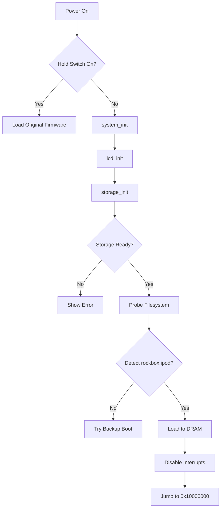

# 02_Bootloader_and_Hardware_Initialization.md

## 1. Bootloader Architecture: The Handoff

The Rockbox bootloader architecture is bifurcated into two primary stages on legacy devices:

1.  **Manufacturer Primary Bootloader:** The ROM-based code burned into the SoC by the vendor (Apple, Toshiba, etc.). This initializes the most basic hardware (sometimes) and loads the secondary bootloader from disk or flash.
2.  **Rockbox Secondary Bootloader:** This is the `bootloader/` directory in the repository. It is a small, specialized binary responsible for:
    *   Initializing SDRAM controller (if not done by Stage 1).
    *   Initializing the storage controller (IDE/ATA, SD/MMC).
    *   Initializing the LCD for basic debug output (`printf`).
    *   Reading the main firmware payload (`rockbox.mi4` or `rockbox.ipod`) into RAM.
    *   Jumping to the main firmware's entry point.

### 1.1 The Bootloader Directory Structure (`bootloader/`)

```text
bootloader/
├── common.c            # Generic loader logic (printf, error handling)
├── ipod.c              # Apple iPod (PortalPlayer) init code
├── sansa_as3525.c      # SanDisk Sansa (AMS AS3525) init code
├── main-*.c            # Entry points for various targets
├── fat32format.c       # Emergency FAT32 formatting tools
├── gigabeat.c          # Toshiba Gigabeat (S3C2440) specifics
├── iriver_h100.c       # iRiver H100 (ColdFire) specifics
└── ucl/                # Decompression logic (for compressed firmware)
```

## 2. `crt0.S`: The Assembly Startup

Before any C code runs, the `crt0.S` (C Runtime Start) assembly file executes. This is the "Big Bang" of the firmware.

### 2.1 Vector Table (ARM Architecture)

From `firmware/target/arm/crt0.S`, the vector table is placed at address `0x00000000` (or mapped there).

```assembly
    .section .init.text,"ax",%progbits
    .global    start
start:
    b   newstart                /* Reset Vector: Address 0x00 */
    b   undef_instr_handler     /* Undefined Instruction: Address 0x04 */
    b   software_int_handler    /* SWI (Software Interrupt): Address 0x08 */
    b   prefetch_abort_handler  /* Prefetch Abort: Address 0x0C */
    b   data_abort_handler      /* Data Abort: Address 0x10 */
    b   reserved_handler        /* Reserved: Address 0x14 */
    b   irq_handler             /* IRQ (Standard Interrupt): Address 0x18 */
    b   fiq_handler             /* FIQ (Fast Interrupt): Address 0x1C */
```

### 2.2 The Startup Sequence (`newstart`)

1.  **Supervisor Mode:** The CPU immediately switches to Supervisor (SVC) mode and disables interrupts (`IRQ` and `FIQ`). This prevents any interrupts from firing before the stack is valid.
    ```assembly
    msr     cpsr_c, #0xd3 /* enter supervisor mode, disable IRQ/FIQ */
    ```

2.  **Memory Initialization (`memory_init`):** On some SoCs (like AS3525 or i.MX233), the bootloader or early firmware must manually configure the SDRAM controller timing and refresh rates before RAM is usable. This involves writing to memory controller registers to set CAS latency, RAS-to-CAS delay, and refresh intervals.

3.  **BSS Clearing:** The `.bss` section (uninitialized globals) must be zeroed out. If this isn't done, static variables will contain random garbage.
    ```assembly
    ldr     r2, =_edata
    ldr     r3, =_end
    mov     r4, #0
1:  cmp     r3, r2
    strhi   r4, [r2], #4
    bhi     1b
    ```

4.  **Stack Setup:** Rockbox sets up separate stacks for different CPU modes to ensure interrupt stability. This is crucial because an IRQ occurring during a user-mode stack overflow shouldn't crash the handler.
    *   `irq_stack`: For standard hardware interrupts.
    *   `fiq_stack`: For high-priority audio interrupts (DMA).
    *   `svc_stack`: For the main execution thread.

    **Stack Painting:** The stack is filled with `0xDEADBEEF` at startup. This allows the debug menu ("System Info") to calculate maximum stack usage by scanning for the first non-`DEADBEEF` value from the bottom.
    ```assembly
    ldr     sp, =stackend
    ldr     r2, =stackbegin
    ldr     r3, =0xdeadbeef
    1:
    cmp     sp, r2
    strhi   r3, [r2], #4
    bhi     1b
    ```

5.  **The Jump:** Finally, it branches to the C entry point.
    ```assembly
    ldr     ip, =main
    bx      ip
    ```

### 2.3 ColdFire Architecture Startup (`firmware/target/coldfire/crt0.S`)

The Motorola ColdFire (used in iRiver H100/H300, iAudio X5) uses a different exception table format.

```assembly
    .section .init
    .global start
start:
    /* Exception Vector Table */
    .long   _stack_end      /* Initial Stack Pointer */
    .long   start           /* Initial Program Counter */
    .long   bus_error       /* Bus Error */
    .long   address_error   /* Address Error */
    /* ... 256 vectors ... */
```

The ColdFire startup code must also configure the **MBAR** (Module Base Address Register) to locate memory-mapped I/O, which is floating on these chips.

### 2.4 MIPS Architecture Startup (`firmware/target/mips/crt0.S`)

Used in Ingenic JZ47xx devices.
*   **Reset Vector:** `0xBFC00000`.
*   **Cache Initialization:** MIPS caches are software-managed. The startup code must initialize the I-Cache and D-Cache tags.
*   **GP Register:** Setting up the Global Pointer (`$gp`) for small data access optimization.

## 3. The Hardware Abstraction Layer (HAL)

Rockbox runs on "Bare Metal," meaning it talks directly to hardware registers without an intervening OS. The HAL isolates the upper layers (Kernel, Apps) from these hardware specifics. This architecture is defined in `firmware/target/`.

### 3.1 The Target Tree (`firmware/target/`)

The HAL is organized hierarchically to maximize code reuse across similar chips.

| Directory | Role | Examples |
| :--- | :--- | :--- |
| `firmware/target/arm/` | Architecture Layer | Interrupt handling, Context switching, Atomic ops |
| `firmware/target/arm/pp/` | Manufacturer/SoC Layer | PortalPlayer (iPod) drivers (I2C, ATA, I2S) |
| `firmware/target/arm/s5l8700/` | Manufacturer/SoC Layer | Samsung S5L8700 (iPod Nano 2G) drivers |
| `firmware/target/arm/as3525/` | Manufacturer/SoC Layer | AMS AS3525 (Sansa v1) drivers |
| `firmware/target/arm/imx233/` | Manufacturer/SoC Layer | Freescale i.MX233 (Creative Zen) drivers |
| `firmware/target/arm/ipod/` | Board/Device Layer | iPod-specific GPIO maps, Keypads |
| `firmware/target/arm/ipod/video/` | Model Layer | iPod Video LCD timings, clickwheel sensitivity |

This polymorphism allows `firmware/export/system.h` to include `target.h`, which in turn includes the correct SoC headers based on the build configuration.

### 3.2 CPU Initialization (`system_init()`)

The `system_init()` function is the first C function called by `main()`. It brings the SoC to life.

#### PortalPlayer (iPod) Detailed Init Logic
In `firmware/target/arm/pp/system-pp502x.c`, the initialization is highly specific to the PP5022/PP5024 SoC.

```c
void system_init(void)
{
    if (CURRENT_CORE == CPU)
    {
#if defined (IPOD_VIDEO)
        /* set minimum startup configuration */
        DEV_EN         = 0xc2000124; // Enable I2S, I2C, USB, ATA blocks
        DEV_EN2        = 0x00000000;
        CACHE_PRIORITY = 0x0000003f; // Give CPU priority over COP (Coprocessor)

        /* Configure GPIO output directions */
        GPO32_VAL     &= 0x00004000;

        /* Initialize Dev Registers to known states */
        DEV_INIT1      = 0x00000000;
        DEV_INIT2      = 0x40000000;

        /* Reset all allowed devices to ensure clean state */
        DEV_RS         = 0x3dfffef8;
        DEV_RS2        = 0xffffffff;
        DEV_RS         = 0x00000000; // Release Reset
        DEV_RS2        = 0x00000000;
#endif

        /* Disable all interrupts at the controller level */
        disable_all_interrupts();

        /* Set CPU frequency to MAX (80MHz) for fast boot */
        pp_set_cpu_frequency(CPUFREQ_MAX);
    }

    /* Initialize the CPU Cache */
    init_cache();
}
```

**Key Registers Explained:**
*   **`DEV_EN` (Device Enable):** A bitmask that gates clocks to various internal peripherals.
*   **`DEV_RS` (Device Reset):** Asserting bits here holds peripherals in reset. Clearing them releases the reset.
*   **`CACHE_PRIORITY`:** The PortalPlayer is a dual-core SoC (CPU + COP). This register arbitrates access to the memory bus.

#### Toshiba Gigabeat S (i.MX31 / S3C2440) Example
The Gigabeat S uses a significantly more complex SoC (ARM1136 with MMU or ARM920T for Gigabeat F).
*   **MMU Setup:** `system_init` sets up Page Tables. Virtual addresses are required because the interrupt vectors are at `0xFFFF0000` (High Vectors), which must be mapped to the vector table in RAM.
*   **Virtual Memory:** Rockbox on Gigabeat S runs with the MMU enabled, mapping physical RAM to a virtual address space.
*   **L2 Cache:** It has an outer L2 cache controller that must be enabled.

#### Frequency Scaling (DVS)
Rockbox implements Dynamic Voltage and Frequency Scaling to save battery.
*   `set_cpu_frequency(long frequency)`: Shifts between `CPUFREQ_MAX` (e.g., 80MHz) and `CPUFREQ_NORMAL` (e.g., 30MHz).
*   During MP3 playback, the CPU is often clocked down.
*   During USB transfer or database commits, it is clocked up.

### 3.3 Memory Controller Setup

For targets where the bootloader doesn't fully initialize RAM, or for "RAM images" loaded via USB, Rockbox must configure the SDRAM controller.
*   **Refresh Rate:** Setting the refresh counter based on the bus clock.
*   **CAS Latency:** Configuring the read latency.
*   **Bank Switching:** Defining the row/column address mapping.

### 3.4 I2C Bit-Banging Implementation

Many legacy targets lack hardware I2C controllers or they are too complex/undocumented, so Rockbox bit-bangs the protocol on GPIO pins. This is robust but CPU intensive.

```c
/* Example Software I2C Implementation */
static void i2c_delay(void) {
    /* Use a busy loop or timer for SDA/SCL timing */
    udelay(5);
}

void i2c_start(void) {
    SDA_LO();
    i2c_delay();
    SCL_LO();
}

void i2c_stop(void) {
    SDA_LO();
    i2c_delay();
    SCL_HI();
    i2c_delay();
    SDA_HI();
}

void i2c_write_byte(unsigned char byte) {
    for (int i = 0; i < 8; i++) {
        if (byte & 0x80) SDA_HI(); else SDA_LO();
        byte <<= 1;
        i2c_delay();
        SCL_HI();
        i2c_delay(); /* Slave reads bit here */
        SCL_LO();
    }
    /* Wait for ACK */
}
```

## 4. The Interrupt Subsystem

Rockbox relies heavily on interrupts for its cooperative/preemptive scheduler.

### 4.1 Vector Interrupt Controller (VIC) vs. AIC

Different SoCs use different interrupt controllers.
*   **PortalPlayer:** Uses a custom Dual-Core Interrupt Controller. It has two main status registers: `CPU_INT_STAT` (Standard) and `CPU_HI_INT_STAT` (High Priority).
*   **Samsung (S5L87xx):** Uses a standard VIC. The `VIC0IRQSTATUS` and `VIC1IRQSTATUS` registers indicate pending interrupts. The vector address is read from `VICVECTADDR`.
*   **AT91 (e200):** Uses the Advanced Interrupt Controller (AIC). It supports priority levels and vectoring directly to handlers.
*   **Ingenic (MIPS):** Uses the Intc controller built into the core.

### 4.2 IRQ vs. FIQ

Rockbox exploits the ARM architecture's two interrupt levels:
*   **IRQ (Interrupt Request):** Used for general system events (Timers, Buttons, USB, Storage). These go through the general ISR dispatcher.
*   **FIQ (Fast Interrupt Request):** Reserved almost exclusively for **Audio DMA**.
    *   FIQ has its own banked registers (`R8_fiq` - `R14_fiq`), reducing context save overhead.
    *   This ensures audio buffers are filled immediately, preventing skips even if the system is busy handling a button press or disk access.

### 4.3 Context Saving

In `firmware/target/arm/irq.S` (or inline assembly in `crt0.S`):

```assembly
irq_handler:
    sub     lr, lr, #4          /* Adjust return address */
    stmfd   sp!, {r0-r3, r12, lr} /* Save scratch registers */
    bl      interrupt_handler   /* Call C handler */
    ldmfd   sp!, {r0-r3, r12, pc}^ /* Restore and return */
```

### 4.4 The C Interrupt Dispatcher (`irq.c`)

When `interrupt_handler` is called from assembly, it must identify the source of the interrupt and call the appropriate driver's ISR.

```c
void interrupt_handler(void)
{
    /* Read the Interrupt Status Register (SoC specific) */
    uint32_t status = INTC_STAT;

    /* Check each bit (Prioritized) */
    if (status & TIMER_MASK) {
        timer_isr();
    }
    else if (status & USB_MASK) {
        usb_isr();
    }
    else if (status & GPIO_MASK) {
        button_isr();
    }

    /* Acknowledge the interrupt (if required) */
    INTC_ACK = status;
}
```

### 4.5 Interrupt Nesting and Latency

Generally, Rockbox avoids nested interrupts to keep the stack size predictable.
*   **IRQ:** Standard IRQs are typically disabled while servicing an IRQ (via the `I` bit in CPSR).
*   **FIQ:** FIQs can preempt IRQs, which is why audio DMA is assigned to FIQ. This ensures minimal latency (< 10us) for audio processing, preventing buffer underruns even if the kernel is busy processing a heavy IRQ (like a USB packet).
*   **Latency Concerns:** Rockbox kernels often have critical sections where interrupts are disabled (`disable_irq()`). These are kept extremely short (just a few cycles) to ensure that the FIQ latency remains deterministic. If an IRQ handler takes too long, it won't block the FIQ, but it might delay other IRQs (like buttons), which is acceptable.

## 5. Peripheral Drivers

### 5.1 GPIO Abstraction & Pin Muxing

GPIOs are mapped to macros in `target.h`. Access is usually via memory-mapped registers. Additionally, modern SoCs require **Pin Muxing** configuration.
*   **Function Selection:** Each pin can be a GPIO, or part of a peripheral (e.g., UART TX, SPI CLK). `system_init` writes to the Pin Control registers to route these signals.
*   **Pull-up/Pull-down:** Internal resistors are configured here.

```c
/* firmware/target/arm/ipod/video/target.h */
#define GPIOA_ENABLE    (*(volatile unsigned long *)(0xcf000000))
#define GPIOA_OUTPUT    (*(volatile unsigned long *)(0xcf000010))
#define BUTTON_MENU     0x00000008
```

The driver (`button.c`) simply does: `if (GPIOA_INPUT & BUTTON_MENU) ...`

### 5.2 LCD Drivers (`lcd-*.c`)

Rockbox supports a wide array of display interfaces:
*   **Parallel 8080/6800:** Direct register writes to the LCD controller. The code often uses inline assembly for tight timing loops (`nop` insertion).
*   **SPI/Serial:** Used in newer players (Sansa Clip). The `lcd-sansa-clip.c` driver bit-bangs SPI or uses the SSP hardware.
*   **Memory Mapped:** Some SoCs (like IMX233) map the framebuffer directly to RAM, and the LCD controller DMA reads it automatically.

**Initialization Sequence (Generic Parallel LCD):**
1.  **Reset:** Pulse the RESET line (GPIO).
2.  **Command Mode:** Send initialization commands (Power Control, Gamma Curve, Display On).
3.  **Data Mode:** Ready to receive pixel data.

```c
void lcd_init(void) {
    lcd_reset();
    lcd_write_command(0x11); // Sleep Out
    sleep(1); // Wait 120ms
    lcd_write_command(0x29); // Display On
    lcd_clear_display();
}
```

### 5.3 Bootloader Graphics

The bootloader cannot use the heavy `apps/gui` engine. It uses a minimal set of drawing primitives.
*   **Font:** Hardcoded arrays of bytes (e.g., 8x8 bitmap).
*   **`lcd_puts`:** Extracts bits from the font array and writes to the framebuffer.

```c
/* Pseudocode for bitmapped character rendering */
void lcd_putchar(int x, int y, char c) {
    const unsigned char *glyph = font_data + (c * 8);
    for (int row = 0; row < 8; row++) {
        unsigned char bits = glyph[row];
        for (int col = 0; col < 8; col++) {
            if (bits & (1 << (7 - col)))
                lcd_draw_pixel(x + col, y + row);
        }
    }
}
```

### 5.4 Storage Subsystem (`ata.c`, `sd.c`)

*   **ATA (IDE):**
    *   Implements PIO (Programmed I/O) mode for compatibility.
    *   Implements UDMA (Ultra DMA) for speed on supported targets.
    *   Handles the crucial **Spin Down** logic. When the audio buffer is full, the disk is put to sleep (`ATA_SLEEP` command) to save power.
*   **SD/MMC:**
    *   Implements the SD state machine (Command/Response).
    *   **Hot Swap:** On targets with SD slots (Sansa e200), the HAL monitors the Card Detect GPIO and triggers a mount/unmount event.

## 6. The Bootloader Logic in Depth

The `bootloader/` code is a stripped-down version of the main firmware logic.

### 6.1 `common.c`: The Loader Core

The `main()` function in `bootloader/common.c` orchestrates the boot process:



```c
void main(void)
{
    /* 1. Initialize Essential Hardware */
    system_init();  // Clocks, Interrupts
    lcd_init();     // Display
    storage_init(); // Disk/Flash

    /* 2. Check for Dual Boot (Hold Switch) */
    if (button_hold()) {
        if (load_original_firmware()) {
            shutdown(); // Failed to load OF
        }
    }

    /* 3. Load Rockbox Firmware */
    unsigned char *loadbuffer = (unsigned char *)DRAM_START;
    int rc = load_firmware(loadbuffer, "rockbox.ipod", MAX_LOAD_SIZE);

    if (rc > 0) {
        /* 4. Launch */
        launch_firmware(loadbuffer, rc);
    } else {
        /* 5. Error Handling */
        error(EBOOTFILE, rc, true);
    }
}
```

### 6.2 Pre-Bootloader Environment

On many devices, the "Primary Bootloader" (the Manufacturer's ROM) looks for a specific file or signature to load.
*   **iPod:** Looks for a partition table with a specific type and a firmware image in a hidden partition.
*   **Sansa:** Looks for a specialized encrypted file (BL.ROM or similar).
*   **Gigabeat:** Uses a standard Windows CE bootloader structure (`NK.BIN`). Rockbox replaces this file.
*   **Recovery Mode:** Many bootloaders support a "Disk Mode" (USB Mass Storage) triggered by holding a button combination during boot. This is implemented in `bootloader/usb.c` and is crucial for recovering "bricked" devices where the main firmware is corrupt.

### 6.3 The Launch Sequence

```c
void launch_firmware(void *addr, int size)
{
    /* 1. Disable Interrupts */
    disable_interrupts();

    /* 2. Flush Caches */
    commit_discard_idcache();

    /* 3. Relocate (if necessary) */
    /* ... decompression logic ... */

    /* 4. Jump */
    void (*entry)(void) = (void*)addr;
    entry();
}
```

### 6.4 Dual-Booting

Many Rockbox bootloaders support dual-booting the original firmware (OF).
*   **Detection:** Checks for a specific button hold (e.g., Hold Switch ON + Rewind).
*   **Validation:** It often computes a checksum (CRC32) of the OF image before launching it to prevent bricking.
*   **Handoff:** If detected, it loads the original firmware image from a hidden partition or a file, and jumps to it instead.

### 6.5 Emergency Disk Formatting (`fat32format.c`)

Some bootloaders (like the iPod) contain a mini FAT32 formatter. This allows users to recover a corrupted disk without needing a PC. It writes a fresh Master Boot Record (MBR) and FAT table directly to the disk sectors.

## 7. Panic Handling (`panic.c`)

When the HAL detects a catastrophic failure (Divide by Zero, Data Abort, Stack Overflow):
1.  **Disable Interrupts:** Stop the world.
2.  **Dump Registers:** Print R0-R15, CPSR, and part of the stack to the LCD.
3.  **Wait for Input:** Wait for a specific button combo to reboot.
4.  **Developer Hooks:** On debug builds, this might trigger a GDB stub over UART.

### 7.1 Exception Vectors in Depth

From `target/arm/irq.S`:

```assembly
undef_instr_handler:
    stmfd   sp!, {r0-r12, lr}   /* Save all registers */
    mov     r0, #0              /* Exception Type 0: Undefined Instruction */
    b       panic_handler       /* Jump to C panic handler */

data_abort_handler:
    stmfd   sp!, {r0-r12, lr}
    sub     lr, lr, #8          /* Adjust LR to point to instruction */
    mov     r0, #1              /* Exception Type 1: Data Abort */
    b       panic_handler
```

## 8. Memory Layout (Memory Map: iPod Video Example)

For the iPod Video (PP5022) with 32MB SDRAM:

| Address Range | Size | Usage |
| :--- | :--- | :--- |
| `0x00000000 - 0x0000FFFF` | 64KB | Internal SRAM (Exception Vectors, Boot ROM mirrors) |
| `0x10000000 - 0x100FFFFF` | 1MB | **Rockbox Kernel Code & Data** (.text, .data, .bss) |
| `0x10100000 - 0x11EFFFFF` | ~30MB | **Audio Buffer** (The bulk of RAM) |
| `0x11F00000 - 0x11FFFFFF` | 1MB | Stacks (SVC, IRQ, FIQ) & Transient Plugin Buffer |
| `0x40000000 - 0x4000FFFF` | 64KB | Memory Mapped Registers (GPIO, I2C, IDE, USB) |
| `0x50000000 - 0x5FFFFFFF` | 256MB | SDRAM Mirror (Uncached) |

The bootloader ensures the main firmware is loaded at `0x10000000` (or `DRAM_START`) before jumping.

## 9. Timer Subsystem

The microsecond timer is critical for the scheduler (`switch_thread`) and sleep functions.
*   **Implementation:** Typically uses a 32-bit hardware timer running at 1MHz or higher.
*   **Tick Generation:** The timer interrupt handler increments `current_tick` (typically 100Hz) which drives the scheduler.
*   **Watchdog:** `system_init()` sets up the Watchdog Timer (WDT). The main thread must kick it periodically, or the system resets. This protects against hard freezes.

## 10. Hardware Revision Detection

Manufacturers often change hardware components (LCDs, Flash chips) silently during production runs. The HAL must detect this.
*   **GPIO Strapping:** Reading specific GPIO pins that are pulled high/low on the PCB to indicate revision.
*   **ID Registers:** Reading the Chip ID register (e.g., `0x70000000` on PortalPlayer).
*   **Probing:** Trying to talk to an I2C device (e.g., FM Tuner). If it ACKs, it's there; if not, it's a different board revision.

## 11. Bootloader User Interface

The bootloader UI is extremely primitive to keep the binary size small (< 100KB).
*   **Font:** A single built-in bitmap font (typically 8x8 or 8x16).
*   **Framebuffer:** Direct writing to the LCD framebuffer memory.
*   **`printf`:** A custom, stripped-down implementation of `printf` that renders text directly to the screen. It supports minimal format specifiers (%d, %s, %x).

## 12. USB Bootloader Mode (Disk Mode)

If the main firmware is corrupt, the bootloader can enter a fallback USB mode (`bootloader/usb.c`).
*   **Enumeration:** It presents itself as a USB Mass Storage Class (MSC) device.
*   **SCSI Wrapper:** It translates SCSI commands (READ_10, WRITE_10) into low-level storage driver calls (`storage_read_sectors`).
*   **RAM Execution:** This mode runs entirely from Internal SRAM or a small locked portion of SDRAM to avoid conflicts with disk access.

## 13. Power Management Unit (PMU)

For devices with advanced PMUs (like the PCF50606 on Sansa e200), the HAL must communicate via I2C to manage power rails.
*   **Voltage Scaling:** `set_cpu_frequency` often pairs with voltage scaling. Lowering the CPU frequency allows lowering the core voltage (`VCORE`), which quadratically reduces power consumption.
*   **Battery Charging:** The PMU handles the constant-current/constant-voltage (CC/CV) charging cycle. The HAL monitors the charging status and battery voltage via ADC readings.

## 14. NAND Flash Handling

On NAND-based targets (like iPod Nano or Sansa c200), Rockbox cannot simply read sectors like on a Hard Drive.
*   **FTL (Flash Translation Layer):** The bootloader often contains a minimal FTL to read the firmware partition.
*   **Raw Access:** Sometimes, it reads raw pages and performs software ECC (Error Correction Code) calculation to validate the data.
*   **IPL (Initial Program Load):** On extremely constrained devices, the CPU loads a tiny "IPL" from the first NAND page, which initializes SDRAM and then loads the full Bootloader.

## 15. Linker Script Analysis

The linker script (`rom.lds` or `bootloader.lds`) controls the final binary layout.

```ld
SECTIONS
{
    .text : {
        *(.vectors)      /* Exception vectors at start */
        *(.init.text)    /* Startup code */
        *(.text*)        /* Main code */
    } > DRAM

    .data : {
        _data = .;
        *(.data*)
        _edata = .;
    } > DRAM

    .bss : {
        _bss = .;
        *(.bss*)
        _ebss = .;
    } > DRAM
}
```

The bootloader script is often more complex, defining regions for **IRAM** (Internal RAM) where code must run while SDRAM is being initialized.

## 16. Bootloader Specific Memory Map

Unlike the main firmware, the bootloader has strict memory constraints. It often runs from **Internal SRAM** (ISRAM) initially because SDRAM is not yet initialized.

| Region | Description |
| :--- | :--- |
| **ISRAM** | The bootloader's `.text` and stack reside here initially. This is usually 64KB-128KB. |
| **SDRAM (Low)** | Once initialized, the bootloader might copy itself here to run faster or handle larger buffers. |
| **SDRAM (High)** | The `loadbuffer` for the main firmware payload (`rockbox.mi4`) is placed here, near the end of physical RAM, to avoid overwriting the bootloader code itself. |

This multi-stage loading process (ISRAM -> SDRAM -> Jump) ensures the system is fully stable before the complex main OS takes over.

### 16.1 Bootloader Button Handling

Unlike the interrupt-driven button driver in the main firmware, the bootloader often uses a simple polling loop to check for recovery modes or dual-boot triggers.

```c
/* Bootloader Button Polling */
int button_read_device(void)
{
    int btn = BUTTON_NONE;
    if ((GPIOA_INPUT & BUTTON_MENU_MASK) == 0) btn |= BUTTON_MENU;
    if ((GPIOB_INPUT & BUTTON_PLAY_MASK) == 0) btn |= BUTTON_PLAY;
    /* ... debounce logic ... */
    return btn;
}
```
