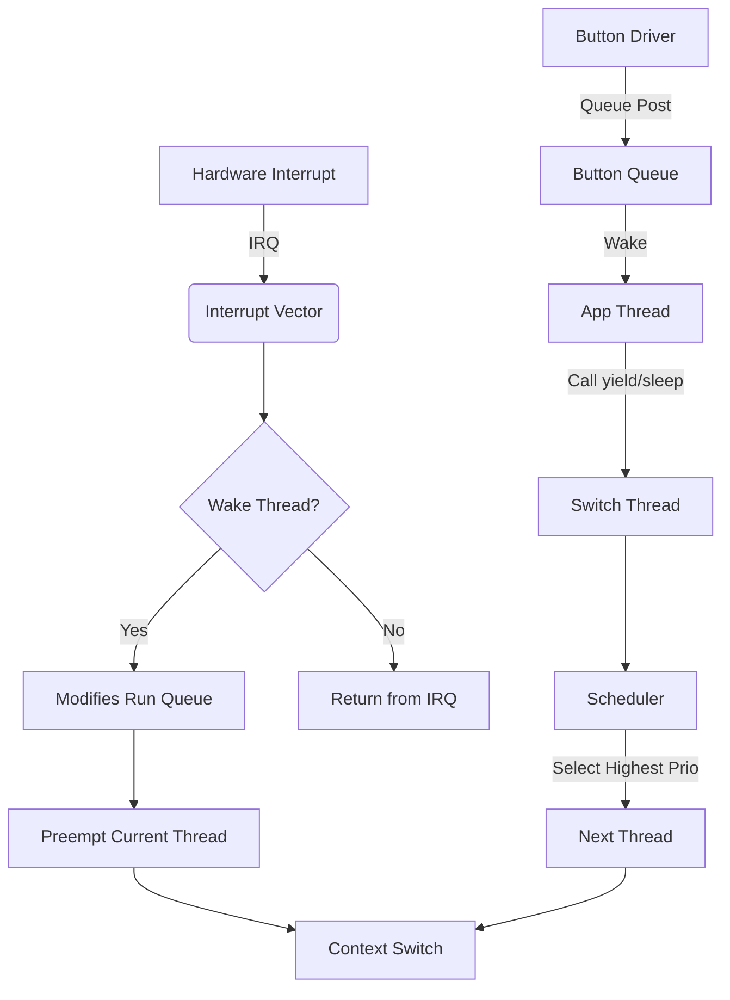

# 03_OS_Core_Kernel_and_Memory_Map.md

## Abstract
This document dissects the bespoke Rockbox kernel, a custom cooperative/preemptive hybrid scheduler designed for extreme efficiency on single-core embedded CPUs. It analyzes the `struct thread_entry` control block, the assembly-optimized context switching logic, and the flat memory model that statically partitions RAM into the kernel, stack, and the massive `audiobuf` ring buffer.

## 1. The Kernel Architecture: Threads & Scheduling
Rockbox implements a bespoke cooperative/preemptive hybrid kernel. It is not POSIX-compliant, nor does it use a standard RTOS like FreeRTOS or ThreadX. It was built from scratch to be extremely lightweight (measured in kilobytes) and deterministic for audio playback.

### 1.1 The Thread Control Block (`struct thread_entry`)
The core of the kernel is the `struct thread_entry`. This structure holds the entire execution context of a thread.

**Source Analysis: `firmware/kernel/thread-internal.h`**
```c
struct thread_entry
{
    /* 1. Context Block (Architecture Specific) */
    struct core_context context; /* Registers (R0-R15, CPSR, PC) */

    /* 2. Scheduler Queues */
    struct __rtr_queue_node rtr; /* Runnable queue node */
    struct __tmo_queue_node tmo; /* Timeout queue node */
    struct __wait_queue_node wq; /* Wait queue node (mutex/semaphore) */

    long tmo_tick;               /* Absolute tick for timeout */
    struct __wait_queue *wqp;    /* Pointer to queue currently waiting on */

    /* 3. Metadata */
    const char *name;            /* Thread name (for debugging) */
    uint32_t id;                 /* Thread ID */
    int __errno;                 /* Thread-local errno */

    /* 4. Priority Scheduling (If enabled) */
#ifdef HAVE_PRIORITY_SCHEDULING
    struct blocker *blocker;     /* Object blocking this thread */
    unsigned char base_priority; /* Initial priority */
    unsigned char priority;      /* Current (possibly boosted) priority */
#endif

    /* 5. State & Stack */
    unsigned char state;         /* STATE_RUNNING, STATE_BLOCKED, etc. */
#ifndef HAVE_SDL_THREADS
    size_t stack_size;           /* Allocated stack size */
#endif
};
```
*Note: The `context` member is typically assembly-optimized to be at offset 0, allowing context switch code (`switch_thread`) to access it directly without pointer arithmetic.*

### 1.2 The Scheduler: Cooperative & Preemptive
Rockbox uses a tick-based scheduler (typically 100Hz or 1000Hz).
*   **Cooperative:** Most threads call `yield()` or `sleep()` voluntarily when waiting for I/O.
*   **Preemptive:** Interrupts (Audio DMA, Timer) can wake high-priority threads (e.g., the audio filling thread), causing an immediate context switch upon return from interrupt.

**Key Function: `switch_thread()` (Conceptual C Logic)**
```c
void switch_thread(void)
{
    struct thread_entry *current = __running_self_entry();
    struct thread_entry *next;

    /* 1. Save Context */
    save_context(&current->context);

    /* 2. Pick Next Thread (Highest Priority Runnable) */
    next = scheduler_pick_next();

    /* 3. Switch Stacks */
    current_core->running = next;

    /* 4. Restore Context */
    restore_context(&next->context);

    /* Jump to new PC */
}
```

### 1.3 Context Switching (Assembly)
The actual context switch is written in pure assembly for speed.
It pushes all registers (R4-R11 on ARM) onto the stack, saves the Stack Pointer (SP) into `thread->context`, loads the new thread's SP, and pops the registers.

---

## 2. The Memory Map: Bare Metal Layout
Rockbox operates in a flat memory model (no virtual memory paging). The physical RAM is statically partitioned at link time (`app.lds`).

### 2.1 The Flat Memory Model
RAM Usage Diagram (Typical 32MB System):
```text
+----------------------+ 0x00000000 (Physical RAM Start)
| Exception Vectors    | (Interrupt handlers)
+----------------------+
| Kernel Code (.text)  | (The firmware binary)
+----------------------+
| Kernel Data (.data)  | (Initialized globals)
+----------------------+
| Kernel BSS (.bss)    | (Zero-initialized globals)
+----------------------+
| Stacks               | (Main stack + IRQ stacks)
+----------------------+
| Audio Buffer         | (The Massive Ring Buffer)
| (.audiobuf)          |
|                      |
| (Size: ~16MB+)       |
+----------------------+ 0x01FFFFFF (Top of RAM)
```

### 2.2 The Audio Buffer (`audiobuf`)
This is the single largest allocation in the system. Rockbox buffers the *entire* decoded track (or as much as fits) into RAM to spin down the hard drive and save battery.
*   **Allocation:** Defined in the linker script (`.lds`) or allocated via `core_alloc()`.
*   **Usage:** Circular buffer. The codec thread writes to the head; the DMA (I2S) reads from the tail.

### 2.3 The Plugin Buffer (`pluginbuf`)
A dedicated region (often overlaying the end of the audio buffer or a separate section) reserved for loading dynamic plugins (`.rock` files). Since Rockbox supports only one plugin at a time, this memory is reused.

---

## 3. Synchronization Primitives
Rockbox implements standard OS primitives but optimized for its cooperative nature.

### 3.1 Mutexes & Semaphores
Defined in `firmware/include/thread.h` and `kernel.h`.

**The `struct corelock` (Spinlock)**
Used for SMP (Symmetric Multi-Processing) on dual-core targets (like PP502x).
```c
struct corelock
{
    volatile int lock; /* 0 = Unlocked, 1 = Locked */
    int core;          /* Owner Core ID */
};
```

**The `struct blocker`**
An abstraction for any object that can block a thread (Mutex, Semaphore, Queue).
```c
struct blocker
{
    struct thread_entry * volatile thread; /* Owner thread */
#ifdef HAVE_PRIORITY_SCHEDULING
    int priority;                          /* Highest waiter priority */
#endif
};
```

### 3.2 Message Queues
Rockbox uses message queues extensively for inter-thread communication (e.g., UI events to the main thread).
*   **Struct:** `struct event_queue`
*   **Mechanism:** A circular buffer of `struct event`.
*   **Blocking:** If the queue is empty, `queue_wait()` calls `block_thread()` putting the caller to sleep until an event is posted.

---

## 4. Interrupt Handling
Rockbox takes over the CPU's interrupt vector table.
*   **IRQ:** Standard interrupts (Timer, GPIO, UART).
*   **FIQ:** Fast Interrupts (reserved for extremely low-latency tasks like Software I2S or bit-banging).

**The `irq_handler` Trampoline:**
1.  Save minimal context (R0-R3, PC, CPSR).
2.  Call `interrupt_vector()` (C dispatcher).
3.  Check if a context switch is required (e.g., Audio thread woke up).
4.  If yes, call `switch_thread()` immediately.
5.  Restore context.

This architecture ensures Rockbox can play gapless audio with <10ms latency even on 50MHz CPUs.

---

## 5. The System Life-Cycle: From Reset to Root Menu
This section traces the execution path from the C entry point to the user interface, highlighting the kernel initialization steps.

### 5.1 The `main()` Entry (`apps/main.c`)
The `crt0.S` assembly jumps here.
```c
/* apps/main.c */
int main(void)
{
    /* 1. Hardware & Kernel Init */
    init();

    /* 2. Subsystem Init */
    list_init();
    tree_init();

    /* 3. Enter Main Loop */
    root_menu(); /* Does not return */
}
```

### 5.2 The `init()` Sequence (`firmware/system.c` & `kernel.c`)
The `init()` function is the "Big Bang" of the OS.
```c
/* firmware/common/init.c (Conceptual) */
void init(void) {
    /* 1. Low-level Hardware */
    system_init();      /* PLL, Caches, GPIOs */
    kernel_init();      /* Scheduler, Queues */

    /* 2. Drivers */
    i2c_init();
    adc_init();
    usb_init();

    /* 3. Storage */
    storage_init();
    fat_init();

    /* 4. Audio Core */
    audio_init();       /* Starts Codec Thread */

    /* 5. User Interface */
    lcd_init();
    button_init();
}
```

### 5.3 Thread Spawning
During initialization, Rockbox spawns its worker threads.
*   **Main Thread:** The thread executing `main()` becomes the UI thread.
*   **Audio Thread:** Created in `audio_init()`, handles disk I/O and buffering.
*   **Codec Thread:** Created in `audio_init()`, handles decoding.
*   **Disk Thread:** Handles ATA/SD access (on some targets).

---

## 6. The Allocator Deep Dive: `core_alloc` vs `malloc`
Rockbox uses a dual-allocator strategy. Standard `malloc` is rarely used (often stubbed out). Instead, `core_alloc` manages the bulk of RAM.

### 6.1 The Buffer Library (`buflib`)
`buflib` is a compactable, movable memory allocator.
*   **Context:** `struct buflib_context core_ctx`.
*   **Memory Pool:** It owns the entire `audiobuf`.
*   **Handles:** Allocations return an integer handle, not a pointer.
*   **Compaction:** When memory is fragmented, `buflib_compact()` moves allocated blocks to create contiguous free space. This requires that users lock/unlock handles or use callbacks.

**Usage in Apps:**
```c
/* apps/buffering.c */
int buffer_handle = core_alloc(1024 * 1024); /* Allocate 1MB */
char *ptr = core_get_data(buffer_handle);    /* Get Pointer */
/* ... use ptr ... */
/* Pointer might become invalid if another thread calls core_alloc! */
```
**Constraint:** Codecs and Plugins execute *inside* the `audiobuf`. The allocator effectively partitions the free space between "Audio Data" and "Code".

### 6.2 The Compaction Algorithm
The compaction logic is a critical piece of the system stability.
1.  **Trigger:** `core_alloc` fails to find a contiguous block.
2.  **Move:** It iterates through allocated blocks, moving them towards the start of the buffer.
3.  **Relocation:** Since Rockbox doesn't use MMU virtual addressing, the *physical* data is moved using `memmove`.
4.  **Callbacks:** If a block is "active" (e.g., the codec is decoding it), it must not be moved. Owners register callbacks to be notified or use `core_pin()` to lock the block in place temporarily.

---

## 7. The Message Bus: `queue` Logic
The `queue` subsystem drives the event-loop architecture of `apps/`.

### 7.1 The Event Loop (`apps/action.c`)
The main thread sits in a loop consuming events.
```c
long get_action(int context, int timeout) {
    struct event ev;
    /* Block until button press or system event */
    queue_wait_w_tmo(&button_queue, &ev, timeout);

    switch (ev.id) {
        case BUTTON_HOME: return ACTION_STD_OK;
        case SYS_USB_CONNECTED: return ACTION_USB_PLUG;
    }
}
```

### 7.2 Broadcasts (`queue_broadcast`)
System-wide events (USB plug, Charger connect) are broadcast to all registered queues.
*   **Registry:** `all_queues[]` array in `firmware/kernel/queue.c`.
*   **Mechanism:** Iterates over all queues and posts the event.
*   **Sync vs Async:** Most events are async (fire and forget). Some system events wait for acknowledgment.

---

## 8. The Kernel-App Interface (KAI)
`apps/` code interacts with the kernel via a specific set of exported functions (`firmware/export/`).

### 8.1 Critical Exports
*   **`sleep(ticks)`**: Cooperative yield. Essential for battery life.
*   **`yield()`**: Give up timeslice to other threads.
*   **`mutex_lock/unlock`**: Protect shared structures (like `global_settings`).
*   **`splash(ticks, str)`**: Simple blocking UI message (uses `sleep` internally).

### 8.2 The Kernel Event Loop Diagram
This diagram visualizes the flow of control in the Rockbox Kernel.



*(Note: Mermaid syntax is provided for reference, but Rockbox docs usually use ASCII)*

**ASCII Version:**
```text
      [ Hardware IRQ ]         [ Application Thread ]
             |                          |
             v                          v
      [ Interrupt Vector ]      [ call sleep() ]
             |                          |
             v                          v
      [ Wakeup Thread X ]       [ Remove from RunQ ]
             |                          |
             v                          v
      [ Set Need_Switch ]       [ Call switch_thread ]
             |                          |
             +-----------+--------------+
                         |
                         v
                [ SCHEDULER CORE ]
                         |
          (Picks Highest Priority Runnable)
                         |
                         v
                [ CONTEXT SWITCH ASM ]
                         |
             +-----------+--------------+
             |                          |
             v                          v
      [ Restore Thread X ]      [ Restore Thread Y ]
```
