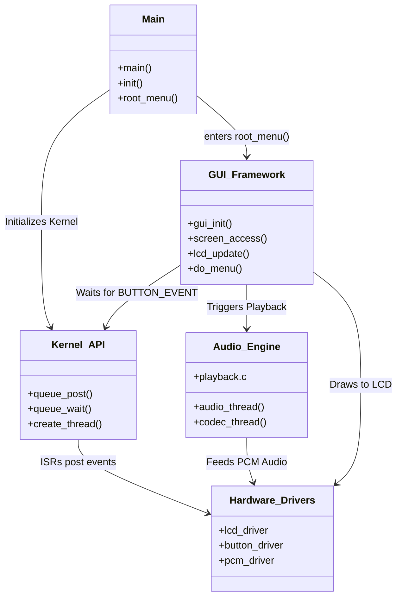

# 04_Applications_Libraries_and_GUI_Framework.md

## 1. Inter-Module Linkage Diagram

This diagram illustrates the high-level flow of control and data between the Application, GUI, and Firmware layers.

## 2. `apps/` (The Application Layer)

The `apps/` directory is the heart of the user experience. It runs as the "Main Thread" (after initialization).

### The UI Event Loop (`apps/main.c` -> `root_menu()`)
Rockbox does not use a typical callback-driven GUI loop everywhere. Instead, it often uses a blocking hierarchical menu system.
1.  `main()` calls `root_menu()`.
2.  `root_menu()` calls `do_menu()`.
3.  `do_menu()` sits in a loop:
    *   Calls `gui_synclist_draw()` to paint the screen.
    *   Calls `button_get()` (which wraps `queue_wait(&button_queue)`).
    *   Dispatches the button code (e.g., `BUTTON_SELECT` -> Enter submenu, `BUTTON_RIGHT` -> Seek).

### The "Action" System (`apps/action.c`)
To handle different keymaps (iPod Clickwheel vs. Sansa Buttons vs. Touchscreen), Rockbox uses an "Action" abstraction.
*   **Input:** Raw button codes (`BUTTON_REC`).
*   **Translation:** `action.c` maps these to logical actions (`ACTION_WPS_PLAY`).
*   **Consumption:** The UI code switches on the logical action, not the raw button.

## 3. `apps/gui/` (The GUI Framework)

The GUI is not a full widget toolkit (like GTK or Qt), but a lightweight set of drawing primitives and screen management.

### `screen_access.c` & `screens.c`
Rockbox supports multiple screens (e.g., Main LCD + Remote LCD).
*   **`screens[]`**: An array of function pointers for drawing operations (`drawpixel`, `puts`, `update`).
*   **`lcd_set_foreground(color)`**: Sets global state for the next drawing op.

### The Viewport System (`viewport.c`)
To support themes (`.wps`, `.sbs`), Rockbox breaks the screen into Viewports.
*   A Viewport is a rectangular clipping region with its own font and draw mode.
*   **Theming:** The Skin Engine parses a config file to define viewports dynamically (e.g., "Album Art here", "Progress Bar there").

### Drawing Primitives
Located in `firmware/drivers/lcd/`.
*   `lcd_update()`: Flushes the framebuffer to the hardware (critical for SPI displays).
*   **Buffering:** Rockbox draws to a RAM framebuffer. `lcd_update()` sends the dirty regions.

## 4. `lib/` (The Engine Room)

Rockbox relies on a suite of statically linked libraries.

### `lib/rbcodec/`
This is arguably the most valuable part of Rockbox. It contains the **Codec API**.
*   **Codecs:** `libmad` (MP3), `tremolo` (Vorbis), `flac`, `wav`.
*   **Architecture:** Codecs are not part of the monolithic firmware binary. They are compiled as **overlays** (separate binaries) loaded into the `audiobuf` on demand.
    *   *Why?* To save RAM. You only need the FLAC decoder when playing FLAC.
*   **DSP Chain:** Equalizer, Crossfeed, Resampler. These process PCM data *after* decoding.

### `fixedpoint/`
Many target CPUs (ARM7TDMI) lack an FPU. Rockbox implements high-performance fixed-point math libraries for decoding audio without floating-point hardware.
*   **ESP32 Note:** The ESP32 has an FPU (Single Precision). We might want to switch some libraries to use hardware float, or stick to fixed-point for compatibility.

## 5. Interactions and Dependencies

### The "Main Thread" vs. "Audio Thread"
1.  **Main Thread (UI):** High priority interaction. It must never block on disk I/O for too long (or the UI stutters).
2.  **Audio Thread:** Extremely high priority. It manages the buffer and feeds the codec.
3.  **Codec Thread:** Lower priority than Audio, but must keep up with decoding.

### Inter-Thread Communication
*   **`audio_play()`**: The UI thread calls this to start music. It posts a message to the Audio Thread queue.
*   **`add_event()`**: The UI registers callbacks to be notified when metadata is loaded or track changes occur.

## 6. ESP32 Adaptation Strategy

### GUI on ESP32
*   **Framebuffer:** The ESP32 has enough RAM (esp. with PSRAM) to hold the full 320x240 (or higher) framebuffer.
*   **`lcd_update` Mapping:** Map this to `esp_lcd_panel_draw_bitmap`. Using standard SPI/I8080 drivers provided by ESP-IDF.
*   **Touchscreen:** Map standard ESP32 I2C touch drivers to Rockbox's `touchscreen.c` input abstraction.

### Library Migration
*   **Codecs:** We must ensure the `rbcodec` build system can generate Xtensa binaries. The overlay mechanism (dynamic loading) is the hardest part.
    *   *Solution:* For the first iteration, **statically link** the most common codecs (MP3, FLAC) into the main firmware image to avoid the complex overlay loader issues. The ESP32 has 4MB+ flash, unlike the 512KB ROMs of 2005. We can afford the space.
