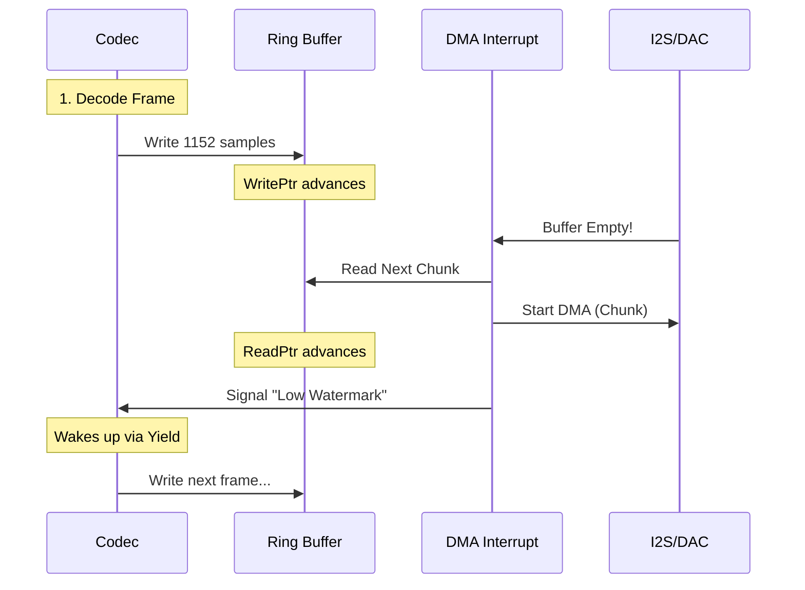

# 07_The_Audio_Pipeline_PCM_I2S_and_DACs.md

## Abstract
This document traces the path of digital audio from the codec output to the analog DAC. It analyzes the double-buffered DMA logic in `pcm.c` that feeds the I2S controller, the interrupt-driven refill mechanism that ensures gapless playback, and the hardware-specific I2C commands used to configure external DACs and ASRC (Asynchronous Sample Rate Converter) chips. It also delves into the Digital Signal Processing (DSP) chain that sits between the decoder and the hardware, including software volume scaling, crossfeed, and resampling.

---

## 1. The Audio Pipeline Overview
The audio pipeline is the heart of Rockbox. It ensures glitch-free playback by meticulously managing data flow from disk to DAC.

### 1.1 The Chain
1.  **Disk (FAT):** Compressed data (MP3) is read into `audiobuf`.
2.  **Codec (Thread):** Reads from `audiobuf`, decodes to PCM (16-bit/44.1kHz), and writes to the **PCM Buffer**.
3.  **DSP (Thread):** Processes PCM (EQ, Volume) in-place in the PCM Buffer.
4.  **PCM Driver (Interrupt):** Reads from PCM Buffer via DMA.
5.  **I2S Controller:** Serializes PCM data to the DAC.
6.  **DAC:** Converts digital samples to analog audio.

---

## 2. PCM Buffering Logic (`firmware/pcm.c`)
The PCM buffer is a circular buffer in SDRAM. The codec writes to the head (`pcm_write_ptr`), and the DMA reads from the tail (`pcm_read_ptr`).

**Source Analysis: `firmware/pcm.c`**
```c
/* PCM Buffer Pointers */
static volatile int pcm_read_ptr;  /* Read by DMA */
static volatile int pcm_write_ptr; /* Written by Codec */
static int pcm_buffer_size;        /* Total Size */
static int16_t *pcm_buffer;        /* Base Address */

/* Insert Samples into PCM Buffer */
void pcmbuf_insert(const void *src, size_t size)
{
    int space = pcmbuf_free();

    if (space < size) {
        /* Wait for DMA to consume data */
        yield();
    }

    /* Copy Data (Handling Wrap-Around) */
    int chunk = MIN(size, pcm_buffer_size - pcm_write_ptr);
    memcpy(pcm_buffer + pcm_write_ptr, src, chunk);

    pcm_write_ptr = (pcm_write_ptr + chunk) % pcm_buffer_size;

    /* Trigger DMA if stopped */
    if (!pcm_is_playing) {
        pcm_play_start();
    }
}
```

### 2.1 Double Buffering & DMA Interrupts
To prevent glitches, Rockbox uses a double-buffering scheme with DMA.
*   **Buffer A:** Being played by DMA.
*   **Buffer B:** Being filled by Codec.
*   **Interrupt (`PCM_DMA_IRQ`):** Fires when Buffer A is done. The ISR immediately points the DMA to Buffer B and signals the codec to refill Buffer A.

```c
/* DMA Completion ISR */
void pcm_dma_interrupt(void)
{
    /* 1. Clear Interrupt Flag */
    DMA_INT_CLEAR = 1;

    /* 2. Advance Read Pointer */
    pcm_read_ptr += DMA_BLOCK_SIZE;
    if (pcm_read_ptr >= pcm_buffer_size)
        pcm_read_ptr = 0;

    /* 3. Setup Next Transfer */
    dma_start(pcm_buffer + pcm_read_ptr, DMA_BLOCK_SIZE);

    /* 4. Wake Codec Thread if low on data */
    if (pcmbuf_free() > THRESHOLD) {
        queue_post(&codec_queue, PCM_NEED_DATA);
    }
}
```

## 3. The Ring Buffer Math: Detailed Trace
The circular buffer logic is deceptive. It must handle boundary crossing for both reads and writes, while being interrupt-safe.

### 3.1 The Insert Logic (`pcmbuf_insert`)
When the codec inserts `count` samples:
1.  **Calculate Wraparound:**
    ```c
    int space_at_end = pcm_buffer_size - pcm_write_ptr;
    int chunk1 = MIN(count, space_at_end);
    int chunk2 = count - chunk1;
    ```
2.  **Wait for Space:**
    The codec must verify `pcmbuf_free()`.
    ```c
    size_t pcmbuf_free(void) {
        if (pcm_read_ptr > pcm_write_ptr)
            return pcm_read_ptr - pcm_write_ptr - 1;
        else
            return pcm_buffer_size - (pcm_write_ptr - pcm_read_ptr) - 1;
    }
    ```
    If `free < count`, the codec yields. The `pcm_read_ptr` is volatile and updated by the ISR, freeing space asynchronously.

### 3.2 The Play Logic (`pcm_play_data`)
The low-level driver usually requests data via a callback.
```c
/* firmware/drivers/pcm-*.c */
void pcm_play_data(void (*callback)(void), const void *start, size_t size) {
    /* Set DMA Source */
    DMA_SRC_ADDR = start;
    /* Set DMA Count */
    DMA_COUNT = size;
    /* Enable DMA & Interrupt */
    DMA_CTRL = DMA_ENABLE | DMA_IRQ_ENABLE;
}
```

### 3.3 Sequence Diagram: The Refill Loop


---

## 4. I2S & Hardware Interface
The I2S (Inter-IC Sound) bus is the standard for digital audio transport.
*   **Signals:**
    *   **BCLK (Bit Clock):** 32x or 64x Sample Rate (e.g., 2.8224 MHz for 44.1kHz).
    *   **LRCK (Left/Right Clock):** Sample Rate (44.1kHz).
    *   **SDATA (Serial Data):** The actual audio bits.
    *   **MCLK (Master Clock):** High-frequency reference (e.g., 11.2896 MHz).

### 4.1 Sample Rate Conversion (ASRC)
Some hardware (like AC97 codecs) runs at a fixed rate (48kHz). Rockbox must resample 44.1kHz MP3s to 48kHz in software or using hardware ASRC blocks if available.

### 4.2 DAC Configuration
The DAC (e.g., Wolfson WM8758) is configured via I2C.
*   **Volume Control:** Digital attenuation inside the DAC (better SNR than software volume).
*   **Mute:** Hardware mute during sample rate changes to prevent pops.

```c
/* Set Volume (Hardware) */
void audiohw_set_volume(int vol_l, int vol_r)
{
    /* Map -74dB to +6dB range to register values */
    int reg_l = (vol_l + 74) * 2;
    int reg_r = (vol_r + 74) * 2;

    i2c_write(DAC_ADDR, WM8758_LOUT1_VOL, reg_l | 0x100); /* Update L */
    i2c_write(DAC_ADDR, WM8758_ROUT1_VOL, reg_r | 0x180); /* Update R + Load */
}
```

---

## 5. DAC Driver Deep Dive: Wolfson WM8758
The Wolfson WM8758 is a common codec used in iPods. Rockbox's driver (`firmware/drivers/audio/wm8758.c`) must manage complex power sequencing.

### 5.1 Register Map Analysis
The WM8758 has dozens of registers. Rockbox touches these critical ones:

| Register | Name | Function | Bit Definitions |
| :--- | :--- | :--- | :--- |
| `0x00` | **Reset** | Writing 0 resets the chip | N/A |
| `0x01` | **Power Management 1** | Bias control | `Bit 0`: VREF Enable, `Bit 1`: AINL Enable |
| `0x02` | **Power Management 2** | DAC/ADC Power | `Bit 8`: DACL Enable, `Bit 7`: DACR Enable |
| `0x03` | **Power Management 3** | Mixer Power | `Bit 2`: LMIX Enable, `Bit 3`: RMIX Enable |
| `0x04` | **Audio Interface** | Format/Word Length | `Bit 4`: 16/20/24/32 bits, `Bit 3`: I2S/DSP Mode |
| `0x05` | **Companding** | Sample Rate Control | `Bit 1-3`: Sample Rate (48k, 44.1k, etc) |
| `0x06` | **Clock Gen** | PLL & MCLK | `Bit 0`: MS (Master/Slave), `Bit 5`: CLKSEL |
| `0x0A` | **DAC Control** | Soft Mute | `Bit 3`: Automute, `Bit 6`: Soft Mute |
| `0x28` | **LOUT1 Volume** | Left Headphone Vol | `Bit 0-5`: Volume (-57dB to +6dB) |
| `0x29` | **ROUT1 Volume** | Right Headphone Vol | `Bit 0-5`: Volume (-57dB to +6dB), `Bit 8`: Update |

### 5.2 Power Sequencing (Pop Suppression)
To avoid "pops" when turning on:
1.  **Enable VMID:** Set `0x01` (PM1) to enable VREF with high impedance (soft start).
2.  **Wait:** Delay 500ms for capacitor charge.
3.  **Enable DAC:** Set `0x02` (PM2) to enable DACL and DACR.
4.  **Unmute:** Clear Soft Mute bit in `0x0A`.
5.  **Ramp Volume:** Slowly increase `LOUT1` and `ROUT1` from minimum to target.

### 5.3 Hardware Bass/Treble
Many DACs have a built-in DSP for tone control. Rockbox prefers to use this over software EQ to save battery.
```c
/* firmware/drivers/audio/wm8758.c */
void audiohw_set_bass(int value) {
    /* Value: -6dB to +9dB. Register 0xBC (Bass Control) */
    /* Bit 0-3: Gain. Bit 6: Bass Filter Cutoff (Linear Phase) */
    int reg_val = (value & 0xF) | (1 << 6);
    wm8758_write(0xBC, reg_val);
}
```

---

## 6. Playback State Machine
The `playback.c` thread manages high-level states:
*   **STOPPED:** DMA off, Codec thread suspended.
*   **PLAYING:** DMA running, Codec filling.
*   **PAUSED:** DMA stopped, but buffers retained.
*   **SEEKING:** Codec thread flushes buffers, seeks file pointer, and refills.

### 6.1 Crossfading
Rockbox supports crossfading between tracks.
*   **Mechanism:** Two codecs run simultaneously (or one codec alternates fast enough).
*   **Mixing:** The PCM buffer receives data from both sources, mixed in software with volume ramping.

### 6.2 Gapless Playback
A signature feature.
*   **Pre-buffering:** While Track A plays, Rockbox decodes the start of Track B into a separate buffer.
*   **Seamless Stitching:** When Track A finishes, the DMA pointer is instantaneously switched to Track B's buffer, resulting in sample-perfect transitions.

---

## 7. The Digital Signal Processing (DSP) Chain
Before the PCM data hits the DMA buffer, it passes through `lib/rbcodec/dsp/dsp.c`.

### 7.1 The DSP Pipeline
1.  **Decoder Output:** Raw PCM from MP3/FLAC.
2.  **Resampler:** Upsample/Downsample if hardware rate != file rate.
3.  **Crossfeed:** Mixes L into R and R into L (delayed/filtered) to simulate speakers on headphones.
4.  **Equalizer:** 5-band parametric EQ (Bi-quad filters).
5.  **ReplayGain:** Applies volume normalization.
6.  **Compressor:** Dynamic range compression.
7.  **Dithering:** Adds noise if down-converting bit depth (e.g. 24->16 bit).
8.  **Output:** Written to `pcmbuf`.

### 7.2 Crossfeed Algorithm Detail
The implementation is a variation of the Bauer stereophonic-to-binaural DSP.
```c
/* lib/rbcodec/dsp/dsp_proc_crossfeed.c */
void dsp_crossfeed_process(struct dsp_proc_entry *this,
                           struct dsp_buffer *src,
                           struct dsp_buffer *dst)
{
    /* Simple Meier Crossfeed */
    /* Low-pass filter the cross-channel signal */
    for (i = 0; i < count; i++) {
        int32_t l = src->l[i];
        int32_t r = src->r[i];

        /* Low-pass filter state */
        data->l_lp = FRAC_MUL(data->c1, l) + FRAC_MUL(data->c2, data->l_lp);
        data->r_lp = FRAC_MUL(data->c1, r) + FRAC_MUL(data->c2, data->r_lp);

        /* Mix */
        dst->l[i] = l + FRAC_MUL(level, data->r_lp);
        dst->r[i] = r + FRAC_MUL(level, data->l_lp);
    }
}
```

### 7.3 Pitch Shifting
Rockbox allows changing playback speed without changing pitch (Timestretch) or changing pitch without speed.
*   **Algorithm:** Uses a SoundTouch-like library (granular synthesis).
*   **CPU Load:** Extremely high. Often disables EQ to run on older targets.

### 7.4 Detailed DSP Flow Diagram
This diagram illustrates the complex flow of PCM data through the DSP processing stages.

```mermaid
graph TD
    A[Decoder (MP3/FLAC)] -->|Raw PCM| B[Resampler]
    B -->|44.1kHz| C[ReplayGain]
    C -->|Normalized| D[Crossfeed]
    D -->|Spatialized| E[Parametric EQ (5-Band)]
    E -->|Equalized| F[Compressor/Limiter]
    F -->|Limited| G[Dithering (16-bit)]
    G -->|Final PCM| H[Software Mixer]
    H -->|Mixed| I[DMA Ring Buffer]
```

---

## 8. Appendix: The I2S Protocol at Bit Level
I2S is a 3-wire serial protocol.
*   **LR Clock (Word Select):** Low = Left Channel, High = Right Channel.
*   **Bit Clock (SCK):** Toggles once for each bit of data.
*   **Data (SD):** MSB First, 2's Complement.

**Timing Diagram:**
```text
      ____      ____      ____      ____      ____      ____
SCK _|    |____|    |____|    |____|    |____|    |____|    |____
    __
WS    |__________________________________________________________
      <--- Left Channel (16 bits) --->         <--- Right ...
SD  ..X MSB X 14 X 13 X .. X LSB X ......      X MSB X 14 ...
```
Rockbox's I2S driver must ensure the `DMA_COUNT` aligns perfectly with the frame boundaries (4 bytes for 16-bit stereo) to avoid channel swapping.

### 8.1 I2S Alignment Modes
Rockbox supports multiple modes depending on the DAC:
1.  **Standard I2S:** Data delayed by 1 SCK cycle relative to WS edge.
2.  **Left Justified:** Data aligned with WS edge.
3.  **Right Justified:** Data aligned with end of WS frame.
4.  **DSP Mode:** WS is a single pulse at the start of the frame.

### 8.2 Historical Context: The MAS3507D
Early Rockbox targets (Archos Jukebox) used the Micronas MAS3507D, which was an MP3 decoder chip, not just a DAC.
*   **Interface:** Parallel Bus (not I2S).
*   **Control:** The CPU sent MP3 frames via a demand-request pin (`DREQ`).
*   **Legacy:** The `mas.c` driver is a relic of this era, showing how Rockbox abstracted "Send Data" to mean either "DMA to I2S" or "Bitbang to Parallel Port".

---

## 9. ASRC Deep Dive (Asynchronous Sample Rate Conversion)
Many modern SoCs (like ESP32 or i.MX) prefer fixed sample rates (48kHz) or run the DAC from a crystal that doesn't divide cleanly into 44.1kHz.

### 9.1 Hardware ASRC
Some codecs (WM8960) have built-in PLLs to generate 44.1kHz from 12MHz.
*   **Mode:** Slave Mode. The DAC generates BCLK/LRCK, and the CPU (I2S Controller) syncs to it.
*   **Driver:** `pcm_init()` must configure the DAC PLL first, then enable the I2S controller in Slave Mode.

### 9.2 Software Resampling
If hardware ASRC is unavailable, Rockbox uses `lib/rbcodec/dsp/resample.c`.
*   **Algorithm:** Polyphase FIR filter.
*   **Cost:** High CPU usage. Resampling 44.1 -> 48kHz consumes ~15MHz on ARM.
*   **Config:** `audiohw_set_frequency` returns the *actual* frequency. If it differs from the requested frequency, the kernel enables the software resampler.

---

## 10. I2S Clock Tree Calculation
Setting the correct sample rate involves integer division of the Master Clock (MCLK).

**Example: 44.1kHz on 11.2896MHz MCLK**
1.  **Target Bit Clock:** $44100 \times 16 \text{ bits} \times 2 \text{ channels} = 1.4112 \text{ MHz}$.
2.  **MCLK Divider:** $11.2896 / 1.4112 = 8$.
3.  **Register:** Set `I2S_CLK_DIV = 8`.

**Example: 44.1kHz on 240MHz (ESP32)**
1.  **Divider:** $240,000,000 / 1,411,200 = 170.068$.
2.  **Fractional Divider:** ESP32 uses an `N` + `a/b` fractional divider to approximate the rate.
3.  **Jitter:** Fractional division introduces jitter. For audiophile quality, an external MCLK crystal is preferred.

---

## 11. Case Study: The Wolfson WM8975 (iPod Video)
The iPod Video (5.5G) uses the WM8975, a successor to the WM8758. The driver structure reveals how Rockbox handles subtle hardware variants.

### 11.1 Key Differences
*   **Differential Outputs:** The WM8975 has fully differential outputs for better noise rejection, requiring specific register flags (`HP_DIFF`) to be set.
*   **Cap-less Mode:** Supports "Capless" headphone drive, removing the need for large DC-blocking capacitors. Rockbox must enable the internal charge pump (`0x2D` bit 0) to generate the negative rail.

### 11.2 The Init Sequence Trace
```c
void wm8975_init(void) {
    /* 1. Software Reset */
    wm8975_write(0x00, 0x00);

    /* 2. Enable Bias and VMID (50k Ohm) */
    wm8975_write(0x01, 0x00C);
    sleep(HZ/2); /* Wait for charge */

    /* 3. Enable Output Mixers */
    wm8975_write(0x34, 0x100); /* LMIX */
    wm8975_write(0x37, 0x100); /* RMIX */

    /* 4. Enable Headphone Output Stages */
    wm8975_write(0x02, 0x180);
}
```

---

## 12. The Recording Path (ADC)
While playback is the primary function, Rockbox is also a capable recorder. The path is the reverse of playback.

### 12.1 The ADC Chain
1.  **Microphone:** Analog signal enters the CODEC (e.g. `LINPUT1`).
2.  **PGA:** Programmable Gain Amplifier boosts the signal (0dB to +30dB).
3.  **ADC:** Digitizes to I2S.
4.  **I2S Controller:** Receives data via DMA into `pcm_record_buffer`.
5.  **Encoder:** The recording thread reads from the buffer and encodes to MP3/WAV.

### 12.2 The Monitoring Loop
To allow the user to hear what they are recording, Rockbox enables a "Sidetone" or "Monitor" path.
*   **Hardware Loopback:** The Codec mixes the ADC input directly to the DAC output (Zero Latency).
*   **Software Loopback:** The CPU copies record buffer to playback buffer (High Latency). Rockbox prefers Hardware Loopback.

---

## 13. Debugging Audio Glitches
Audio glitches are the most common bug in porting. They sound like clicks, pops, or stutters.

### 13.1 Buffer Underrun
*   **Symptom:** Periodic silence or repeated buffer segments.
*   **Cause:** The Codec thread is not decoding fast enough to keep up with the DMA.
*   **Fix:** Increase `CPU_BOOST` frequency or optimize the decoder.

### 13.2 DMA Race Conditions
*   **Symptom:** Swapped stereo channels or white noise bursts.
*   **Cause:** The DMA pointer is updated non-atomically, or the I2S FIFO isn't flushed between tracks.
*   **Fix:** Ensure `DMA_INT_CLEAR` is the *first* instruction in the ISR.

### 13.3 I2S Clock Mismatch
*   **Symptom:** Audio plays at wrong speed or pitch (chipmunk effect).
*   **Cause:** MCLK/LRCK ratio is incorrect.
*   **Fix:** Verify the PLL settings with an oscilloscope.

---

## 14. The "Boost" CPU Frequency Scaling
Rockbox uses dynamic frequency scaling to save power.
*   **Idle:** 10-30 MHz (UI only).
*   **Decoding:** 80-160 MHz (Standard MP3).
*   **Boost:** Max frequency (e.g., 240MHz on ESP32) when the buffer is low.

### 14.1 The Boost Trigger
The `pcmbuf` logic triggers boost:
```c
if (pcmbuf_free() > threshold) {
    cpu_boost(true); /* Ramp up voltage/frequency */
} else {
    cpu_boost(false); /* Drop back to energy saving */
}
```
This hysteresis loop is critical for battery life. On the ESP32, this maps to switching between `160MHz` and `240MHz`.

---

## 15. Anti-Skip Buffering
Rockbox was designed for HDDs that skip when shaken.
*   **Logic:** The entire file is read into the massive `audiobuf` (16MB+).
*   **Behavior:** The disk spins up, fills the buffer in 2 seconds, and spins down.
*   **Result:** The player can play for 20 minutes (MP3 @ 128kbps) from RAM with the disk off. This is the primary reason Rockbox had better battery life than original firmware on many devices.

---

## 16. S/PDIF Output
Some devices (iRiver H100) support Optical Out.
*   **Driver:** The I2S controller is configured to output S/PDIF format (Bi-phase Mark Code).
*   **Bit-Perfect:** The DSP is often bypassed to send bit-perfect 44.1kHz data to an external DAC.

---

## 17. The Software Mixer Architecture (`pcm_mixer.c`)
To support voice prompts (the "Voice User Interface") while music is playing, Rockbox includes a software mixer.

### 17.1 Channel Summing
The mixer takes two inputs: the music PCM stream and the voice prompt PCM stream.
*   **Logic:** `Output = (Music * MusicVol) + (Voice * VoiceVol)`.
*   **Saturation:** Simple addition can overflow 16-bit integers (clipping). Rockbox uses saturated addition assembly instructions (`qadd` on ARM) to clamp values to `[-32768, 32767]`.

### 17.2 Cross-Channel Mixing (Mono/Stereo)
The mixer also handles downmixing.
*   **Mono Output:** `Out = (L + R) / 2`.
*   **Karaoke Mode:** `Out = (L - R)` (Removes center-panned vocals).

### 17.3 The Cross-Fading State Machine
The mixer manages the state of crossfading between two audio tracks (A and B).
*   **States:** `FADE_NONE`, `FADE_MIX`, `FADE_CROSS`.
*   **Logic:**
    1.  **Init:** Buffer B is pre-filled.
    2.  **Trigger:** Track A ends or User presses Next.
    3.  **Fade:** Over `N` seconds, `Volume A` ramps 100% -> 0%, `Volume B` ramps 0% -> 100%.
    4.  **Math:** Linear interpolation using fixed-point `FRAC_MUL`.

## 18. Troubleshooting Guide: Audio Artifacts
Common audio problems and their likely root causes.

| Symptom | Probable Cause | Fix |
| :--- | :--- | :--- |
| **Periodic Clicking** | DMA buffer interrupt not clearing correctly or double-firing. | Check `DMA_INT_CLEAR` in ISR. |
| **High Pitched Whine** | Power supply noise coupled into DAC analog rail. | Enable proper PMIC filtering/LDO. |
| **Distortion/Clipping** | Digital volume > 0dB without limiter. | Enable Compressor in DSP settings. |
| **Stereo Swap** | DMA word alignment off by 16 bits. | Check DMA transfer size (16 vs 32 bit). |
| **Silence** | Mute GPIO active or DAC powered down. | Verify `audiohw_mute(false)` logic. |

## 19. Audio Hardware Abstraction Layer (HAL) Map
This table summarizes the key functions that a new port must implement in `firmware/target/`.

| Function | Role | Typical Implementation |
| :--- | :--- | :--- |
| `pcm_init()` | Setup I2S/DMA | `i2s_driver_install()` (ESP-IDF) |
| `pcm_play_lock()` | Start DMA | `i2s_write()` (ESP-IDF) |
| `audiohw_set_volume()` | DAC Gain | I2C Write to Codec |
| `audiohw_set_frequency()`| Sample Rate | `i2s_set_clk()` + I2C PLL Setup |
| `audiohw_mute()` | Pop suppression | Toggle Mute GPIO / DAC bit |

## 20. Conclusion
The audio pipeline is a high-performance engine that demands strict adherence to real-time constraints. Any blocking operation in the I2S ISR or the Codec thread will result in audible skips ("glitches"). The ESP32 port must utilize the `i2s_write` API carefully, ensuring the FreeRTOS scheduler allows the audio task to pre-empt network activity.
