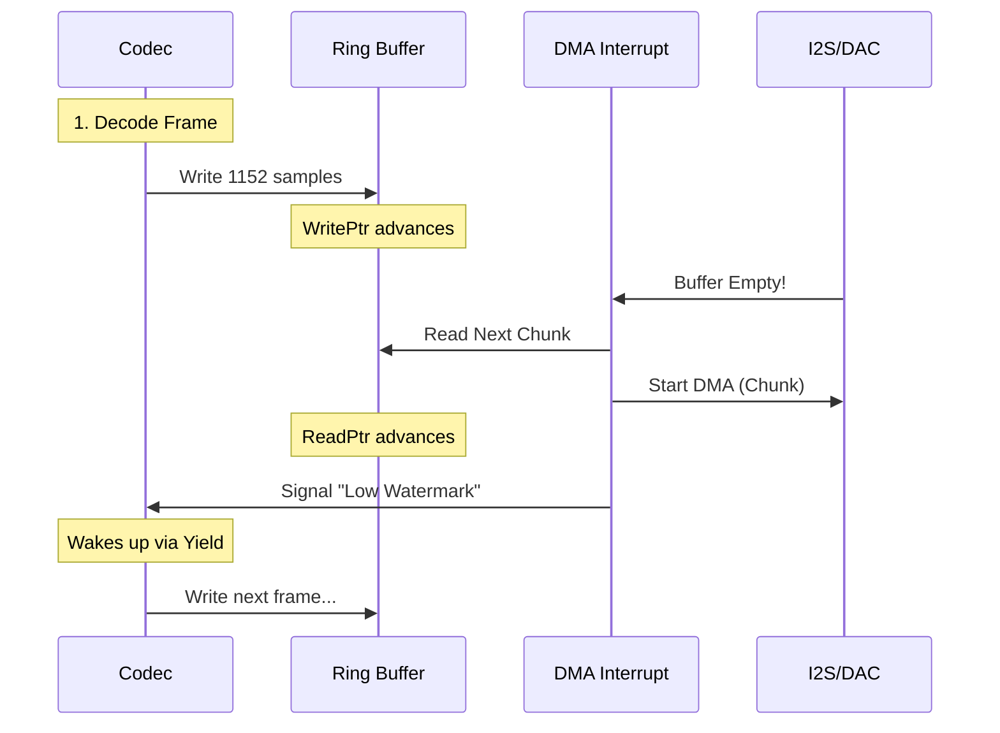

# 07_The_Audio_Pipeline_PCM_I2S_and_DACs.md

## Abstract
This document traces the path of digital audio from the codec output to the analog DAC. It analyzes the double-buffered DMA logic in `pcm.c` that feeds the I2S controller, the interrupt-driven refill mechanism that ensures gapless playback, and the hardware-specific I2C commands used to configure external DACs and ASRC (Asynchronous Sample Rate Converter) chips.

## 1. The Audio Pipeline Overview
The audio pipeline is the heart of Rockbox. It ensures glitch-free playback by meticulously managing data flow from disk to DAC.

### 1.1 The Chain
1.  **Disk (FAT):** Compressed data (MP3) is read into `audiobuf`.
2.  **Codec (Thread):** Reads from `audiobuf`, decodes to PCM (16-bit/44.1kHz), and writes to the **PCM Buffer**.
3.  **DSP (Thread):** Processes PCM (EQ, Volume) in-place in the PCM Buffer.
4.  **PCM Driver (Interrupt):** Reads from PCM Buffer via DMA.
5.  **I2S Controller:** Serializes PCM data to the DAC.
6.  **DAC:** Converts digital samples to analog audio.

---

## 2. PCM Buffering Logic (`firmware/pcm.c`)
The PCM buffer is a circular buffer in SDRAM. The codec writes to the head (`pcm_write_ptr`), and the DMA reads from the tail (`pcm_read_ptr`).

**Source Analysis: `firmware/pcm.c`**
```c
/* PCM Buffer Pointers */
static volatile int pcm_read_ptr;  /* Read by DMA */
static volatile int pcm_write_ptr; /* Written by Codec */
static int pcm_buffer_size;        /* Total Size */
static int16_t *pcm_buffer;        /* Base Address */

/* Insert Samples into PCM Buffer */
void pcmbuf_insert(const void *src, size_t size)
{
    int space = pcmbuf_free();

    if (space < size) {
        /* Wait for DMA to consume data */
        yield();
    }

    /* Copy Data (Handling Wrap-Around) */
    int chunk = MIN(size, pcm_buffer_size - pcm_write_ptr);
    memcpy(pcm_buffer + pcm_write_ptr, src, chunk);

    pcm_write_ptr = (pcm_write_ptr + chunk) % pcm_buffer_size;

    /* Trigger DMA if stopped */
    if (!pcm_is_playing) {
        pcm_play_start();
    }
}
```

### 2.1 Double Buffering & DMA Interrupts
To prevent glitches, Rockbox uses a double-buffering scheme with DMA.
*   **Buffer A:** Being played by DMA.
*   **Buffer B:** Being filled by Codec.
*   **Interrupt (`PCM_DMA_IRQ`):** Fires when Buffer A is done. The ISR immediately points the DMA to Buffer B and signals the codec to refill Buffer A.

```c
/* DMA Completion ISR */
void pcm_dma_interrupt(void)
{
    /* 1. Clear Interrupt Flag */
    DMA_INT_CLEAR = 1;

    /* 2. Advance Read Pointer */
    pcm_read_ptr += DMA_BLOCK_SIZE;
    if (pcm_read_ptr >= pcm_buffer_size)
        pcm_read_ptr = 0;

    /* 3. Setup Next Transfer */
    dma_start(pcm_buffer + pcm_read_ptr, DMA_BLOCK_SIZE);

    /* 4. Wake Codec Thread if low on data */
    if (pcmbuf_free() > THRESHOLD) {
        queue_post(&codec_queue, PCM_NEED_DATA);
    }
}
```

## 3. The Ring Buffer Math: Detailed Trace
The circular buffer logic is deceptive. It must handle boundary crossing for both reads and writes, while being interrupt-safe.

### 3.1 The Insert Logic (`pcmbuf_insert`)
When the codec inserts `count` samples:
1.  **Calculate Wraparound:**
    ```c
    int space_at_end = pcm_buffer_size - pcm_write_ptr;
    int chunk1 = MIN(count, space_at_end);
    int chunk2 = count - chunk1;
    ```
2.  **Wait for Space:**
    The codec must verify `pcmbuf_free()`.
    ```c
    size_t pcmbuf_free(void) {
        if (pcm_read_ptr > pcm_write_ptr)
            return pcm_read_ptr - pcm_write_ptr - 1;
        else
            return pcm_buffer_size - (pcm_write_ptr - pcm_read_ptr) - 1;
    }
    ```
    If `free < count`, the codec yields. The `pcm_read_ptr` is volatile and updated by the ISR, freeing space asynchronously.

### 3.2 The Play Logic (`pcm_play_data`)
The low-level driver usually requests data via a callback.
```c
/* firmware/drivers/pcm-*.c */
void pcm_play_data(void (*callback)(void), const void *start, size_t size) {
    /* Set DMA Source */
    DMA_SRC_ADDR = start;
    /* Set DMA Count */
    DMA_COUNT = size;
    /* Enable DMA & Interrupt */
    DMA_CTRL = DMA_ENABLE | DMA_IRQ_ENABLE;
}
```

### 3.3 Sequence Diagram: The Refill Loop


---

## 4. I2S & Hardware Interface
The I2S (Inter-IC Sound) bus is the standard for digital audio transport.
*   **Signals:**
    *   **BCLK (Bit Clock):** 32x or 64x Sample Rate (e.g., 2.8224 MHz for 44.1kHz).
    *   **LRCK (Left/Right Clock):** Sample Rate (44.1kHz).
    *   **SDATA (Serial Data):** The actual audio bits.
    *   **MCLK (Master Clock):** High-frequency reference (e.g., 11.2896 MHz).

### 3.1 Sample Rate Conversion (ASRC)
Some hardware (like AC97 codecs) runs at a fixed rate (48kHz). Rockbox must resample 44.1kHz MP3s to 48kHz in software or using hardware ASRC blocks if available.

### 3.2 DAC Configuration
The DAC (e.g., Wolfson WM8758) is configured via I2C.
*   **Volume Control:** Digital attenuation inside the DAC (better SNR than software volume).
*   **Mute:** Hardware mute during sample rate changes to prevent pops.

```c
/* Set Volume (Hardware) */
void audiohw_set_volume(int vol_l, int vol_r)
{
    /* Map -74dB to +6dB range to register values */
    int reg_l = (vol_l + 74) * 2;
    int reg_r = (vol_r + 74) * 2;

    i2c_write(DAC_ADDR, WM8758_LOUT1_VOL, reg_l | 0x100); /* Update L */
    i2c_write(DAC_ADDR, WM8758_ROUT1_VOL, reg_r | 0x180); /* Update R + Load */
}
```

---

## 5. DAC Driver Deep Dive: Wolfson WM8758
The Wolfson WM8758 is a common codec used in iPods. Rockbox's driver (`firmware/drivers/audio/wm8758.c`) must manage complex power sequencing.

### 5.1 Register Map
*   `0x00` Reset
*   `0x01` Power Management 1 (VMID, VREF)
*   `0x02` Power Management 2 (Headphone Out, DAC)
*   `0x03` Power Management 3 (Mixer, Mic)
*   `0x04` Audio Interface Control (I2S Format, Word Length)

### 5.2 Power Sequencing (Pop Suppression)
To avoid "pops" when turning on:
1.  Enable VMID (Voltage Mid-Rail) with high impedance (soft start).
2.  Wait for capacitor charge.
3.  Enable DAC.
4.  Unmute output.

### 5.3 Hardware Bass/Treble
Many DACs have a built-in DSP for tone control. Rockbox prefers to use this over software EQ to save battery.
```c
/* firmware/drivers/audio/wm8758.c */
void audiohw_set_bass(int value) {
    /* Value: -6dB to +9dB */
    /* Map to register 0xBC */
    wm8758_write(0xBC, value & 0xF);
}
```

---

## 6. Playback State Machine
The `playback.c` thread manages high-level states:
*   **STOPPED:** DMA off, Codec thread suspended.
*   **PLAYING:** DMA running, Codec filling.
*   **PAUSED:** DMA stopped, but buffers retained.
*   **SEEKING:** Codec thread flushes buffers, seeks file pointer, and refills.

### 4.1 Crossfading
Rockbox supports crossfading between tracks.
*   **Mechanism:** Two codecs run simultaneously (or one codec alternates fast enough).
*   **Mixing:** The PCM buffer receives data from both sources, mixed in software with volume ramping.

### 4.2 Gapless Playback
A signature feature.
*   **Pre-buffering:** While Track A plays, Rockbox decodes the start of Track B into a separate buffer.
*   **Seamless Stitching:** When Track A finishes, the DMA pointer is instantaneously switched to Track B's buffer, resulting in sample-perfect transitions.

## 7. Appendix: The I2S Protocol at Bit Level
I2S is a 3-wire serial protocol.
*   **LR Clock (Word Select):** Low = Left Channel, High = Right Channel.
*   **Bit Clock (SCK):** Toggles once for each bit of data.
*   **Data (SD):** MSB First, 2's Complement.

**Timing Diagram:**
```text
      ____      ____      ____      ____
SCK _|    |____|    |____|    |____|    |____
    __
WS    |______________________________________
      <--- Left Channel (16 bits) --->
SD  ..X MSB X 14 X 13 X .. X LSB X ......
```
Rockbox's I2S driver must ensure the `DMA_COUNT` aligns perfectly with the frame boundaries (4 bytes for 16-bit stereo) to avoid channel swapping.

---

## 8. ASRC Deep Dive (Asynchronous Sample Rate Conversion)
Many modern SoCs (like ESP32 or i.MX) prefer fixed sample rates (48kHz) or run the DAC from a crystal that doesn't divide cleanly into 44.1kHz.

### 8.1 Hardware ASRC
Some codecs (WM8960) have built-in PLLs to generate 44.1kHz from 12MHz.
*   **Mode:** Slave Mode. The DAC generates BCLK/LRCK, and the CPU (I2S Controller) syncs to it.
*   **Driver:** `pcm_init()` must configure the DAC PLL first, then enable the I2S controller in Slave Mode.

### 8.2 Software Resampling
If hardware ASRC is unavailable, Rockbox uses `lib/rbcodec/dsp/resample.c`.
*   **Algorithm:** Polyphase FIR filter.
*   **Cost:** High CPU usage. Resampling 44.1 -> 48kHz consumes ~15MHz on ARM.
*   **Config:** `audiohw_set_frequency` returns the *actual* frequency. If it differs from the requested frequency, the kernel enables the software resampler.

---

## 9. I2S Clock Tree Calculation
Setting the correct sample rate involves integer division of the Master Clock (MCLK).

**Example: 44.1kHz on 11.2896MHz MCLK**
1.  **Target Bit Clock:** $44100 \times 16 \text{ bits} \times 2 \text{ channels} = 1.4112 \text{ MHz}$.
2.  **MCLK Divider:** $11.2896 / 1.4112 = 8$.
3.  **Register:** Set `I2S_CLK_DIV = 8`.

**Example: 44.1kHz on 240MHz (ESP32)**
1.  **Divider:** $240,000,000 / 1,411,200 = 170.068$.
2.  **Fractional Divider:** ESP32 uses an `N` + `a/b` fractional divider to approximate the rate.
3.  **Jitter:** Fractional division introduces jitter. For audiophile quality, an external MCLK crystal is preferred.

## 10. Conclusion
The audio pipeline is a high-performance engine that demands strict adherence to real-time constraints. Any blocking operation in the I2S ISR or the Codec thread will result in audible skips ("glitches"). The ESP32 port must utilize the `i2s_write` API carefully, ensuring the FreeRTOS scheduler allows the audio task to pre-empt network activity.
