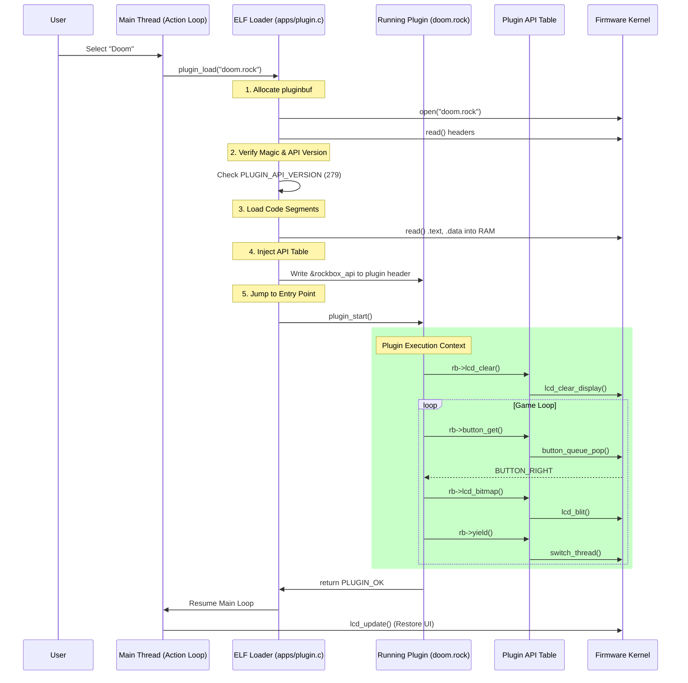

# 08_Applications_GUI_and_The_Plugin_Paradox.md

## Abstract
This document dissects the upper layers of the Rockbox firmware: the User Interface (UI) engine and the dynamic plugin system. It explores how Rockbox achieves a rich, windowed GUI on resource-constrained embedded devices using a custom "logical framebuffer" abstraction. Furthermore, it provides an exhaustive analysis of the "Plugin Paradox"—the mechanism by which Rockbox loads and executes position-independent code (PIC) binaries (`.rock` files) at runtime without an MMU, dynamic linker, or standard OS loader. This is achieved through a massive, versioned API trampoline table (`struct plugin_api`) that bridges the gap between the firmware's symbol table and the plugin's execution context.

---

## 1. The Graphical User Interface (GUI) Subsystem

The Rockbox GUI is a lightweight, cooperative windowing system built directly on top of the Hardware Abstraction Layer (HAL). It does not use a standard library like Qt or GTK; instead, it implements its own drawing primitives, font rendering engine, and viewport manager optimized for monochrome, grayscale, and color LCDs ranging from 128x64 to 320x240 pixels.

### 1.1 The `screen` Abstraction (`apps/gui/screen_access.c`)
At the core of the GUI is the `struct screen` definition. Rockbox supports dual-display devices (e.g., flip phones or players with a remote control LCD). The `screens[]` array acts as the primary interface for all drawing operations, effectively serving as a Virtual Function Table (VTable) in C.

**Architectural Definition:**
```c
/* apps/screen_access.c */
struct screen screens[NB_SCREENS] = {
    {
        .screen_type    = SCREEN_MAIN,
        .lcdwidth       = LCD_WIDTH,
        .lcdheight      = LCD_HEIGHT,
        .depth          = LCD_DEPTH,
        .pixel_format   = LCD_PIXELFORMAT,

        /* Coordinate Translation & Metrics */
        .getnblines     = &screen_helper_getnblines,
        .getcharwidth   = &screen_helper_getcharwidth,
        .getcharheight  = &screen_helper_getcharheight,

        /* Viewport Management */
        .init_viewport  = &lcd_init_viewport,
        .set_viewport   = &lcd_set_viewport,
        .update_viewport= &lcd_update_viewport,

        /* Drawing Primitives (Hardware Accelerated if available) */
        .drawpixel      = &lcd_drawpixel,
        .drawline       = &lcd_drawline,
        .drawrect       = &lcd_drawrect,
        .fillrect       = &lcd_fillrect,
        .bitmap         = &lcd_bitmap,

        /* Font Rendering */
        .puts           = &lcd_puts,
        .putsxy         = &lcd_putsxy,
        .putsf          = &lcd_putsf,

        /* Hardware Control */
        .update         = &lcd_update,       /* Push framebuffer to LCD RAM */
        .set_contrast   = &lcd_set_contrast,
        .backlight_on   = &backlight_on,
    },
    /* ... SCREEN_REMOTE definition ... */
};
```

### 1.2 The Viewport Manager (`apps/gui/viewport.c`)
Rockbox does not have "windows" in the desktop sense. Instead, it uses **Viewports**. A viewport is a rectangular clipping region of the screen.
*   **Clipping:** All drawing commands are clipped to the active viewport's boundaries.
*   **Layering:** There is no Z-ordering. The "active" viewport is simply the one currently receiving drawing commands.
*   **Status Bar:** The status bar is just a reserved viewport at the top of the screen.

**Data Structure:**
```c
struct viewport {
    int x, y;           /* Position relative to screen */
    int width, height;  /* Dimensions */
    int font;           /* Active font ID */
    int drawmode;       /* ROP: XOR, COPY, INVERSE */
    struct frame_buffer_t *buffer; /* Pointer to pixel data */
    /* ... flags ... */
};
```

### 1.3 The Main Event Loop (`apps/action.c`)
The Rockbox application logic is driven by a single cooperative event loop. It polls the button queue, checks timers, and dispatches actions to the active context (e.g., Main Menu, WPS, Plugin).

**The "Action" Abstraction:**
Raw button codes (e.g., `BUTTON_HOME` or `GPIO_PIN_5`) are mapped to logical **Actions** (e.g., `ACTION_WPS_PLAY`). This allows the same application code to run on devices with completely different physical layouts.

```c
/* apps/action.c */
int get_action(int context, int timeout)
{
    long button = button_get_w_tmo(timeout);

    if (button == BUTTON_NONE)
        return ACTION_NONE;

    /* Map physical button to logical action based on context */
    switch (context) {
        case CONTEXT_WPS:
            if (button == BUTTON_PLAY) return ACTION_WPS_PLAY;
            if (button == BUTTON_LEFT) return ACTION_WPS_PREV;
            break;
        case CONTEXT_TREE:
            if (button == BUTTON_PLAY) return ACTION_TREE_ENTER;
            break;
    }
    return ACTION_STD_BUTTON_PRESS;
}
```

### 1.4 The Status Bar: A Micro-Application (`apps/gui/statusbar.c`)
The status bar is technically a viewport, but it acts like a separate application that runs concurrently with the main UI. It manually blits icons for battery, volume, and play state directly to the framebuffer.

**Iconography & Bitmaps:**
The status bar does not use the standard font engine for icons. Instead, it uses hardcoded bitmap arrays (e.g., `bitmap_icons_7x8`) to ensure pixel-perfect rendering on low-resolution displays (e.g., 128x64).

**The Redraw Logic:**
To save CPU cycles, the status bar only redraws when state changes.
```c
/* apps/gui/statusbar.c */
void gui_statusbar_draw(struct gui_statusbar *bar, bool force)
{
    /* Check for state changes */
    if (force ||
        bar->info.battlevel != battery_level() ||
        bar->info.volume != global_status.volume)
    {
        /* 1. Save current viewport */
        struct viewport *last_vp = bar->display->set_viewport(&status_vp);

        /* 2. Draw Icons */
        bar->display->mono_bitmap(bitmap_icons_7x8[Icon_Play], ...);
        gui_statusbar_icon_battery(bar->display, ...);

        /* 3. Push to LCD */
        bar->display->update_viewport();

        /* 4. Restore previous viewport */
        bar->display->set_viewport(last_vp);
    }
}
```

---

## 2. The Plugin System: Dynamic Code on Bare Metal

Rockbox's most impressive architectural feat is its ability to load and execute arbitrary binary code (`.rock` plugins) at runtime. This mimics the functionality of `dlopen()`/`dlsym()` in POSIX systems but runs on bare metal without an OS, virtual memory, or relocation tables.

### 2.1 The "Plugin Paradox"
**Problem:** Plugins are compiled separately from the firmware. The firmware's function addresses change with every commit. If a plugin calls `lcd_puts(0x12345678)`, that address will be wrong in the next build.
**Solution:** Rockbox uses a **Trampoline API Table**. The plugin never calls firmware functions directly. Instead, it calls them via a pointer table provided by the firmware at load time.

### 2.2 The API Table (`firmware/export/plugin.h`)
This table is a massive struct containing function pointers to *every* exported firmware service. It acts as the "System Call" interface for plugins.

**The Master Struct (Partial Dump):**
```c
/* apps/plugin.h - Version 279 */
struct plugin_api {
    /* 1. Core System & Globals */
    const char *rbversion;
    struct user_settings* global_settings;

    /* 2. LCD & Drawing (Function Pointers) */
    void (*lcd_update)(void);
    void (*lcd_clear_display)(void);
    void (*lcd_putsxy)(int x, int y, const unsigned char *string);
    void (*lcd_drawpixel)(int x, int y);
    void (*lcd_bitmap)(const fb_data *src, int x, int y, int w, int h);

    /* 3. Multi-Threading & Kernel */
    unsigned (*sleep)(unsigned ticks);
    void (*yield)(void);
    unsigned int (*create_thread)(void (*func)(void), ...);
    void (*mutex_lock)(struct mutex *m);

    /* 4. File I/O (POSIX-like) */
    int (*open)(const char *path, int oflag, ...);
    ssize_t (*read)(int fd, void *buf, size_t count);
    off_t (*lseek)(int fd, off_t offset, int whence);

    /* 5. Audio Control */
    void (*audio_play)(unsigned long elapsed, unsigned long offset);
    void (*audio_stop)(void);
    void (*sound_set)(int setting, int value);

    /* 6. Input */
    long (*button_get)(bool block);

    /* 7. Settings & Variables */
    bool (*set_option)(const char* string, const void* variable, ...);
    int (*settings_save)(void);

    /* 8. Memory Management (Buflib) */
    void   (*buflib_init)(struct buflib_context* ctx, void* buf, size_t size);
    int    (*buflib_alloc)(struct buflib_context* ctx, size_t size);
    int    (*buflib_free)(struct buflib_context* ctx, int handle);
    void*  (*buflib_get_data)(struct buflib_context* ctx, int handle);

    /* 9. Playlist Control */
    struct playlist_info* (*playlist_get_current)(void);
    int (*playlist_insert_track)(struct playlist_info* playlist, ...);
    void (*playlist_shuffle)(int random_seed, int start_index);

    /* 10. Voice User Interface (Talk) */
    int (*talk_id)(int32_t id, bool enqueue);
    int (*talk_file)(const char *root, ...);
    void (*talk_time)(const struct tm *tm, bool enqueue);

    /* 11. DSP Control */
    void (*dsp_eq_enable)(bool enable);
    int32_t (*dsp_get_timestretch)(void);
    void (*pcm_apply_settings)(void);

    /* 12. USB & Power */
    bool (*usb_inserted)(void);
    int (*battery_level)(void);
    void (*sys_poweroff)(void);
};
```

### 2.3 The Plugin Header (`LC_HEADER`)
Every `.rock` file begins with a specific header that the loader verifies. This header resides in a special `.header` ELF section.

```c
/* apps/plugin.h */
struct plugin_header {
    struct lc_header lc_hdr;         /* Magic, Target ID, Checksum */
    enum plugin_status (*entry_point)(const void*); /* The main() */
    const struct plugin_api **api;   /* Pointer to the API pointer */
    size_t api_size;                 /* Size of struct plugin_api */
};

#define PLUGIN_MAGIC 0x526F634B      /* "RocK" in ASCII */
```

### 2.4 The Loader Logic (`apps/plugin.c`)
The `plugin_load()` function performs the magic of linking the running firmware to the static plugin binary.

**Step-by-Step Execution Flow:**

1.  **File Open:** The firmware opens the `.rock` file.
2.  **Magic Check:** Reads the header, verifies `PLUGIN_MAGIC` and `TARGET_ID`.
3.  **Version Check:** Verifies `hdr->api_version == PLUGIN_API_VERSION`. This is critical. If the API struct layout has changed (even by one byte), the plugin is rejected to prevent crashing.
4.  **Load to RAM:** The code is read into `pluginbuf`.
    *   *Note:* `pluginbuf` is a fixed memory region defined in the linker script (`app.lds`), usually at the end of RAM.
5.  **API Injection:**
    *   The loader locates the `api` pointer in the plugin's header.
    *   It writes the address of the firmware's `rockbox_api` table into that pointer.
    *   `*(p_hdr->api) = &rockbox_api;`
6.  **Transfer Control:** The firmware jumps to `p_hdr->entry_point()`.

### 2.5 Coding a Plugin (The Developers Perspective)
When a developer writes a plugin, they use macros that dereference this API table transparently.

**Example Plugin Code:**
```c
#include "plugin.h"

/* The API pointer (injected by loader) */
const struct plugin_api *rb;

enum plugin_status plugin_start(const void* parameter)
{
    /* rb points to the host firmware's API table */
    rb->lcd_clear_display();
    rb->lcd_puts(0, 0, "Hello World");
    rb->lcd_update();

    while(1) {
        if (rb->button_get(true) == BUTTON_HOME)
            break;
    }
    return PLUGIN_OK;
}
```

---

## 3. Memory Management & TSR
Rockbox runs in a flat memory model. Plugins must play nice with the rest of the system.

### 3.1 The Audio Buffer Conflict
Plugins often need large amounts of RAM (e.g., Doom, Quake). This RAM usually overlaps with the `audiobuf` used for music buffering.
*   **Exclusive Mode:** When a "heavy" plugin loads, playback stops, and the plugin claims the `audiobuf`.
*   **Overlay Mode:** Small plugins (like Solitaire) fit in `pluginbuf` and allow music to keep playing in the background.

```c
/* apps/plugin.c */
static void* plugin_get_audio_buffer(size_t *buffer_size)
{
    /* Allocates the ENTIRE remaining heap */
    plugin_buffer_handle = core_alloc_maximum(&plugin_buffer_size, &buflib_ops_locked);
    return core_get_data(plugin_buffer_handle);
}
```

### 3.2 Terminate and Stay Resident (TSR)
Some plugins (like the `alarm` or `sleep_timer`) need to run in the background.
*   **Mechanism:** The plugin returns `PLUGIN_TSR_CONTINUE` instead of `PLUGIN_OK`.
*   **Callback:** It registers a callback function `plugin_tsr(exit_callback)`.
*   **Persistence:** The plugin's code remains in `pluginbuf`, and its threads continue to be scheduled by the kernel. The loader refuses to load new plugins until the TSR plugin exits.

### 3.3 Viewer Plugins: The "Open With" Mechanism
A special class of plugins are **Viewers**. These are associated with file extensions (e.g., `.txt` -> `text_viewer.rock`, `.jpg` -> `jpeg_viewer.rock`).

**The Dispatch Flow (`apps/open_plugin.c`):**
When the user selects a file in the File Browser:
1.  **Detection:** The browser checks `filetypes.c` to find the associated plugin.
2.  **Invocation:** It calls `plugin_load("viewers/jpeg_viewer.rock", filename)`.
3.  **Parameter Passing:** The `filename` is passed as the `void* parameter` to the plugin's entry point.

**The "Overlay" Strategy for Viewers:**
Viewers often need to decode large files (like 5MP JPEGs) on devices with <2MB RAM.
*   **Audio Stop:** Most viewers (JPEG, Video) stop audio playback to reclaim the `audiobuf`.
*   **Hybrid Mode:** The Text Viewer and Game Boy Emulator are optimized to run *inside* `pluginbuf` while leaving `audiobuf` intact, allowing users to read or play while listening to music.

---

## 4. Architectural Summary
The Rockbox GUI and Plugin system represents a masterclass in embedded systems engineering. By defining a strict ABI (`struct plugin_api`) and a virtualized display interface (`struct screen`), Rockbox decouples the application layer from the hardware. This allows the same `doom.rock` binary to run on an iPod Video (ARM), a SanDisk Sansa (ARM+Thumb), and an iRiver H300 (ColdFire), provided they are compiled for the correct architecture, without changing a single line of source code.

This architecture—specifically the **API Table Injection**—is the blueprint we will use to port Rockbox to the ESP32, allowing us to maintain the dynamic nature of the OS even on a Harvard Architecture chip where executing code from RAM is difficult (as we will see in File 10).

---

## 5. The Application Linkage: Codec Swapping

While plugins are user-facing applications, Rockbox uses a very similar mechanism for audio codecs (`.codec` files). This allows the firmware to support dozens of formats (FLAC, Vorbis, AAC, MP3) without bloating the main kernel image.

### 5.1 The `codec_api` Structure
Just like plugins, codecs are dynamic libraries loaded into a specific memory region (`codecbuf`). They communicate with the main firmware via a `codec_api` table.

```c
/* apps/codecs.h */
struct codec_api {
    /* File I/O for reading the audio stream */
    ssize_t (*read_file)(int fd, void *buf, size_t count);
    off_t   (*lseek)(int fd, off_t offset, int whence);

    /* DSP & Audio Output */
    void (*yield)(void);
    bool (*buffer_alloc)(struct codec_root *root, size_t *size);
    void (*configure)(int setting, intptr_t value);

    /* Metadata Updates */
    void (*set_elapsed)(unsigned long elapsed);
    void (*set_offset)(unsigned long offset);
};
```

### 5.2 The Codec Thread (`apps/codec_thread.c`)
The codec runs in its own thread, distinct from the audio thread and the main thread.
1.  **Request:** The main thread (playlist) identifies the file type (e.g., `.flac`).
2.  **Load:** The `codec_thread` loads the `flac.codec` binary into `codecbuf`.
3.  **Execute:** It jumps to the codec's entry point, passing the `codec_api` struct.
4.  **Loop:** The codec enters a decoding loop:
    *   Read chunks of file data.
    *   Decode to PCM.
    *   Push PCM to the ring buffer.
    *   **Yield:** Critical! The codec must call `rb->yield()` to allow the audio thread to mix and output the sound.

### 5.3 Codec Overlays
Because `codecbuf` is a fixed size (typically ~200KB), only one codec can be loaded at a time. Switching from an MP3 to a FLAC file triggers a full unload/reload cycle. This is why "gapless playback" required significant engineering to preload the next codec while the current one is finishing.

---

## 6. Interaction Diagram: The Full System

The following diagram illustrates the interaction between the Kernel, the Plugin Loader, and the running Plugin.


