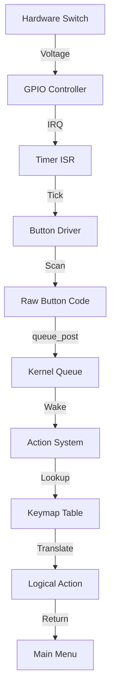

# 12_Apps_Folder_Breakdown_and_System_Connections.md

## Abstract
The `apps/` directory is the User Space of Rockbox. It contains the high-level application logic, the Graphical User Interface (GUI), the playback engine, and the plugin system. Unlike the `firmware/` directory, which deals with register-level hardware details, `apps/` deals with logical abstractions: "Play Track", "Draw Window", "Open Menu". This document provides an exhaustive anatomical breakdown of the `apps/` folder, traces the system lifecycle from `main()` to shutdown, and maps the crucial Application-Firmware Interface (AFI) that connects the user experience to the bare metal.

---

## 1. The Anatomy of `apps/`
The `apps/` folder is a massive tree containing over 500,000 lines of code. It is organized by function, not by hardware.

### 1.1 The Master Directory Tree
```text
apps/
├── action.c            # The Central Nervous System (Input -> Action)
├── action.h            # Action codes (ACTION_WPS_PLAY, etc.)
├── audio_thread.c      # The Conductor of the Audio Subsystem
├── buffering.c         # The Disk-to-RAM buffer manager
├── codecs/             # Codec interfaces (wrappers for lib/rbcodec)
│   ├── flac.c
│   ├── mp3.c
│   ├── vorbis.c
│   └── ...
├── gui/                # The Visual Cortex (Windowing System)
│   ├── bitmap/         # Bitmap decoding (BMP)
│   ├── skin_engine/    # The WPS Theme Engine parser
│   ├── list.c          # The List Widget (Menus, File Browser)
│   ├── statusbar.c     # The top status bar logic
│   ├── viewport.c      # Window clipping and management
│   └── wps.c           # While Playing Screen logic
├── lang/               # Localization (strings)
├── main.c              # The Big Bang (Entry Point)
├── menus/              # Definition of all Menu structures
├── playback.c          # High-level playback logic (Crossfade, Skip)
├── plugins/            # The Dynamic Loader & Built-in Plugins
│   ├── bitmaps/        # Resources for plugins
│   ├── lib/            # Shared plugin libraries (Simple GUI, GreyLib)
│   ├── doom/
│   ├── rockboy/        # Gameboy Emulator
│   └── ...
├── recorder/           # Recording-specific logic
│   ├── peakmeter.c     # VU Meter drawing
│   └── recording.c     # Encoder control
├── settings.c          # Configuration load/save (config.cfg)
├── tagcache.c          # The Database Engine (TagCache)
├── tree.c              # The File Browser logic
└── usb_screen.c        # The "Connected" screen
```

### 1.2 Key Subsystems Analysis

#### 1.2.1 The GUI Engine (`apps/gui/`)
The GUI is a cooperative, viewport-based windowing system.
*   **No Malloc:** Most widgets use static memory or stack allocation to avoid fragmentation.
*   **Immediate Mode:** Drawing commands (`puts`, `draw_line`) execute immediately on the framebuffer.
*   **Viewport Stack:** The screen is divided into viewports (Status Bar, Main Window). The `screens[]` array holds the driver pointers.

#### 1.2.2 The Plugin Loader (`apps/plugins/`)
*   **`open_plugin.c`:** Handles the "Open With" logic for filetypes.
*   **`plugin.c`:** The actual ELF loader. It allocates memory, relocates symbols, and injects the `plugin_api` table.

#### 1.2.3 The Recording Suite (`apps/recorder/`)
Contains the logic for the "Recording Screen".
*   **`peakmeter.c`:** Reads PCM peaks from the `audio_thread` and draws them 50 times a second.
*   **`recording.c`:** Manages the encoder thread, file splitting, and gain control.

---

## 2. The System Lifecycle: From `main()` to `shutdown()`
The `apps/main.c` file contains the `main()` function, which is the entry point for the "OS" logic after `crt0.S` finishes.

### 2.1 The Initialization Sequence (`init()`)
The `init()` function (static in `main.c`) brings the system up in a specific order. Dependencies are critical here.

```c
/* apps/main.c */
static void init(void)
{
    /* 1. Hardware Base */
    system_init();      /* Clocks, WDT, Interrupts */
    core_allocator_init(); /* Heap Setup */
    kernel_init();      /* Scheduler, Queues, Mutexes */

    /* 2. Drivers */
    i2c_init();
    power_init();
    enable_irq();       /* Interrupts LIVE */
    lcd_init();         /* Display ON */

    /* 3. Filesystem */
    storage_init();     /* SD/MMC/IDE Bus Up */

    /* 4. Settings (Critical for UI/Audio config) */
    settings_load();    /* Read config.cfg */

    /* 5. Audio Subsystem */
    pcm_init();         /* I2S/DAC */
    dsp_init();         /* EQ/Resampler */
    audio_init();       /* Spawn Audio Thread */

    /* 6. Network/Radio */
    wifi_init();
    radio_init();
}
```

**Trace Detail: `system_init()` (The very first call)**
Before `main()` even starts, the `crt0.S` has set up the stack. `system_init()` is the bridge between ASM and C.
```c
/* firmware/target/arm/system-arm.c */
void system_init(void) {
    /* 1. Invalidate Caches */
    invalidate_icache();
    invalidate_dcache();

    /* 2. Configure PLL (Clock Tree) */
    /* This speeds up the CPU from 24MHz (Crystal) to 200MHz */

    /* 3. Configure Memory Controller */
    /* Enable SDRAM refresh and timing */

    /* 4. Setup Exception Vectors */
    /* Copy vector table to 0x00000000 if mapped to RAM */
}
```

### 2.2 The "Thread Zero" Concept
The `main()` function runs in the context of the initial thread (Thread ID 1). After `init()` completes, this thread becomes the **GUI Thread** (also known as the Main Thread).
*   **Role:** It executes the main event loop (`root_menu()`).
*   **Priority:** `PRIORITY_USER_INTERFACE` (Medium).
*   **Stack:** Uses the initial stack set up by `crt0.S`.

### 2.3 The Event Loop (`apps/root_menu.c`)
The system enters `root_menu()`, which calls `do_menu()`, which enters the primary loop:
```c
while (1) {
    int action = get_action(CONTEXT_MAINMENU, TIMEOUT_BLOCK);
    switch (action) {
        case ACTION_STD_NEXT:
            /* Move Selection Down */
            break;
        case ACTION_STD_OK:
            /* Enter Submenu */
            break;
    }
}
```

### 2.4 The Shutdown Sequence
When `sys_poweroff()` is called:
1.  **Shutdown Handlers:** Registered callbacks (e.g., storage flush) run.
2.  **`audio_stop()`:** The audio thread is killed.
3.  **`settings_save()`:** Final config write.
4.  **`power_off()`:** The HAL driver cuts the PMIC hold signal.

---

## 3. The Event Nervous System: Input Pipeline
How does a physical voltage drop on a GPIO pin become `ACTION_STD_NEXT` in the GUI? This pipeline is the "Nervous System" of Rockbox.

### 3.1 Step 1: The Hardware Interrupt (Bare Metal)
1.  User presses "Next".
2.  GPIO voltage drops.
3.  **Timer IRQ** (`timer-as3525.c`) fires (100Hz).
4.  ISR calls `button_tick()`.

### 3.2 Step 2: The Driver Scan
1.  `button_tick()` calls `button_read_device()`.
2.  Driver reads GPIOs, debounces them (checks `last_state`).
3.  If stable press detected, it calls `queue_post(&button_queue, BUTTON_NEXT)`.

### 3.3 Step 3: The Action Translator (`apps/action.c`)
The GUI thread is blocked on `get_action()`.
1.  `get_action()` calls `get_action_worker()`.
2.  Worker waits on `button_queue`.
3.  Worker wakes up with `BUTTON_NEXT`.
4.  **Context Mapping:** It looks up `BUTTON_NEXT` in the keymap for `CONTEXT_MAINMENU`.
5.  **Translation:** It finds that `BUTTON_NEXT` maps to `ACTION_STD_NEXT`.
6.  `get_action()` returns `ACTION_STD_NEXT`.

### 3.4 Step 4: The Hosted Divergence
On **Hosted** platforms (Android/SDL), Step 1 and 2 are different:
*   **Android:** Java UI thread captures Touch event -> JNI call -> `queue_post`.
*   **SDL:** SDL Event Loop captures `SDL_KEYDOWN` -> `queue_post`.
*   **Result:** Step 3 (Action Translator) is identical. `apps/action.c` is the great equalizer.

### 3.5 Key Remapping (`core_keymap.c`)
Rockbox supports user-definable keymaps (`.kbd` files).
*   **Default:** `firmware/target/arm/as3525/sansa-clip/keymap-target.h`.
*   **Override:** `action.c` checks `key_remap` before the default map.
*   **Structure:**
    ```c
    struct button_mapping {
        int action_code;
        int button_code;
        int pre_button_code; /* For combos like Hold+Select */
    };
    ```

### Diagram: The Event Pipeline


---

## 4. The Application-Firmware Interface (AFI)
Rockbox does not use System Calls (swi/svc). It uses a monolithic link. The `apps/` code calls `firmware/` functions directly.

### 4.1 The Exported Headers (`firmware/export/`)
These headers define the "Public API" of the kernel/drivers.
*   `audio.h`: High-level playback control.
*   `button.h`: Input queue access.
*   `lcd.h`: Drawing primitives.
*   `kernel.h`: Threading, sleep, yield.

### 4.2 The "Global State" Pattern
Rockbox uses global variables for system state, shared across `apps/` and `firmware/`.
*   **`global_settings`:** Defined in `apps/settings.c`, extern'd everywhere.
    *   Example: `firmware/drivers/audio/wm8758.c` reads `global_settings.volume` to set hardware registers.
*   **`global_status`:** Runtime status (Battery level, Playback state).

### 4.3 Case Study: Volume Control
Trace of a volume change event:
1.  **Input:** User presses Vol+. `get_action` returns `ACTION_WPS_VOLUP`.
2.  **Logic:** `apps/wps/wps.c` calls `sound_set(SOUND_VOLUME, val + 1)`.
3.  **Firmware:** `firmware/sound.c` updates `global_settings.volume`.
4.  **Driver:** `sound.c` calls `audiohw_set_volume()`.
5.  **Hardware:** `firmware/drivers/audio/wm8758.c` writes to I2C register `0x20`.

---

## 5. Subsystem Connectors: How `apps/` drives `firmware/`

### 5.1 The GUI <-> LCD Connector
*   **Apps Side:** `apps/gui/screen_access.c` manages `framebuffer`.
*   **Interface:** `screens[0].update()`.
*   **Firmware Side:** `firmware/drivers/lcd-*.c`.
*   **The Data:** The framebuffer is just a pointer. `apps` writes to it, `firmware` reads from it via DMA/SPI.

### 5.2 The Playback <-> PCM Connector
*   **Apps Side:** `apps/playback.c` fills `audiobuf` from disk.
*   **Apps Side:** `lib/rbcodec` decodes to `pcmbuf` (Software Ring Buffer).
*   **Interface:** `pcm_play_data()`.
*   **Firmware Side:** `firmware/pcm.c` sets up DMA to drain `pcmbuf`.
*   **The Handshake:** `firmware` fires an interrupt when the DMA is half-empty, calling a callback in `apps` to decode more data.

**Code Dump: The PCM Connector**
```c
/* apps/pcmbuf.c */
void pcmbuf_callback(...) {
    /* Called by ISR (Bare Metal) or Audio Thread (Hosted) */
    if (pcmbuf_read_ptr < needed) {
        /* Not enough data! */
        trigger_cpu_boost();
        return;
    }
    /* DSP Processing */
    dsp_process(dma_buf, needed);
}
```

### 5.3 The Tree <-> Storage Connector
*   **Apps Side:** `apps/tree.c` asks for `dir_get_info()`.
*   **Firmware Side:** `firmware/common/dir.c` (FAT driver) reads sectors.
*   **Interface:** `storage_read_sectors()`.
*   **Cache:** `firmware/common/dircache.c` keeps the FAT table in RAM to speed up `apps` browsing.

### 5.4 The "Tree" Logic
`apps/tree.c` is the core of the file browser.
*   **State Machine:** It maintains the current directory state.
*   **Buffer:** Uses a large static buffer (`tree_buffer`) to store the file list.
*   **Sorting:** Sorts the list in-place (quicksort).
*   **Filtering:** Uses `filetypes.c` to decide which files to show.

---

## 6. Hosted vs. Bare Metal Connection Matrix
This table summarizes how the `apps/` layer connects to the lower layers in different environments.

| Subsystem | Apps Layer (Common) | Connection API | Bare Metal Provider | Hosted (SDL) Provider | ESP32 (RTOS) Provider |
| :--- | :--- | :--- | :--- | :--- | :--- |
| **GUI** | `gui_wps_draw` | `lcd_update` | `lcd-as3525.c` (DBOP) | `lcd-sdl.c` (Surface) | `esp_lcd` (SPI) |
| **Audio** | `audio_thread` | `pcm_play_data` | `pcm-as3525.c` (DMA) | `pcm-sdl.c` (Callback) | `i2s_write` (DMA) |
| **Input** | `get_action` | `button_queue` | `button-as3525.c` (GPIO) | `sim_input.c` (Events) | `gpio_isr` (Queue) |
| **Storage** | `tree.c` | `open / read` | `fat.c` + `ata.c` | `file-posix.c` | `esp_vfs_fat` |
| **Power** | `powermgmt.c` | `adc_read` | `adc-as3525.c` | `sim_power.c` (Fake) | `adc_oneshot` |

---

## 7. App-Specific Architectures

### 7.1 The Recorder Architecture
The Recording screen (`apps/recorder/`) is almost a separate OS.
*   **State Machine:** `REC_STATE_MONITOR` -> `REC_STATE_RECORDING`.
*   **Data Flow:** `pcm_record_data` (DMA Input) -> `enc_stream` (Encoder Thread) -> `write` (Disk).
*   **Peak Meter:** The Peak Meter is drawn in a high-priority interrupt/timer callback to ensure smooth animation (50fps) even if the disk write stalls the main thread.

### 7.2 The Plugin Loader Logic
Plugins defy the monolithic model.
*   **The Trap:** Plugins access firmware functions via `rb->function_name`.
*   **The Implementation:** `apps/plugin.c` constructs the `plugin_api` struct and passes it to the plugin's `main`.
*   **Memory:** Plugins "steal" the audio buffer. `playback.c` must be stopped before a plugin loads to free up the RAM.

### 7.3 The Boot Data Architecture
Some targets (like iPods) pass data from the bootloader to the app via `bootdata.c`.
*   **Struct:** `struct boot_data`
*   **Fields:** `boot_volume`, `payload_size`, `chksum`.
*   **Usage:** `apps/main.c` verifies this data to ensure the firmware isn't corrupted.

---

## 8. Appendix: Trace of a Keypress (Bare Metal vs Hosted)

### 8.1 Bare Metal Trace
```c
/* 1. IRQ */
void TIMER1_IRQHandler(void) {
    /* 2. Driver Tick */
    button_tick();
}

/* 3. Driver Logic */
void button_tick(void) {
    int btn = read_gpio();
    if (debounce(btn)) {
        /* 4. Queue Post */
        queue_post(&button_queue, btn);
    }
}

/* 5. Application */
void get_action_worker(...) {
    /* 6. Wakeup */
    int btn = queue_wait(&button_queue);
    return map_button_to_action(btn);
}
```

### 8.2 Hosted Trace (SDL)
```c
/* 1. OS Event Loop */
void sim_input_loop(void) {
    SDL_WaitEvent(&ev);
    if (ev.type == SDL_KEYDOWN) {
        /* 2. Map SDL Key to Rockbox Button */
        int btn = map_sdl_to_rb(ev.key);
        /* 3. Queue Post */
        queue_post(&button_queue, btn);
    }
}

/* 4. Application (Same as above) */
void get_action_worker(...) {
    int btn = queue_wait(&button_queue);
    return map_button_to_action(btn);
}
```
This proves that the `apps/` layer is decoupled from the interrupt context.

---

## 9. Hosted vs Native Architecture
(Moved to Section 6 table for clarity)

---

## 10. Deep Dive: The Theme Engine (`apps/gui/skin_engine/`)
Rockbox's visual flexibility comes from its skin engine, one of the most complex parsers in the codebase. It parses `.wps` (While Playing Screen) and `.sbs` (Status Bar Screen) files at runtime to define the UI layout.

### 10.1 The Skin Token Parser
The engine reads strings like `%s%?cf<%cf|%ct|%c>` and compiles them into a "Display List" of tokens. This avoids re-parsing the string every frame.
*   **Token Types:** `SKIN_TOKEN_STRING`, `SKIN_TOKEN_TAG_ID3`, `SKIN_TOKEN_IMAGE`.
*   **Conditionals:** The `%?xx<true|false>` logic is compiled into a miniature syntax tree within the token list.
*   **Performance:** The parsing happens once (on load). Rendering iterates the token list, which is extremely fast.

### 10.2 Viewport Integration
Skins can define their own viewports (`%V`), allowing them to sub-divide the screen.
*   **Logic:** `skin_render()` sets the viewport `current_vp`, draws the tokens for that viewport, and restores the previous viewport.
*   **Layering:** The skin engine can draw *under* the UI (Backdrop) or *over* it (Status Bar).

**Code Dump: Skin Token Structure**
```c
/* apps/gui/skin_engine/skin_parser.h */
struct skin_token {
    unsigned short type; /* SKIN_TOKEN_TEXT, etc. */
    union {
        struct {
            char *text;
        } text;
        struct {
            struct skin_token *true_branch;
            struct skin_token *false_branch;
        } conditional;
        struct {
            int id3_tag_id;
        } tag;
    } data;
    struct skin_token *next;
};
```

---

## 11. The Language System (`apps/lang/`)
Rockbox supports 50+ languages using a custom, compact string table system.

### 11.1 The Source: `.lang` Files
*   **Source:** `apps/lang/english.lang` contains lines like `id: "String"`.
*   **Build Time:** The `genlang` Perl script converts these into:
    1.  `lang_core.c`: An array of string pointers for the compiled-in language (English).
    2.  `.lng` binary files: For loadable languages.

### 11.2 Runtime Loading
*   **Built-in:** `str(LANG_OK)` simply returns `language_strings[LANG_OK]`.
*   **Loaded:** `lang_load()` reads the `.lng` file into a dedicated RAM buffer and updates the `language_strings` pointer table to point to the new strings in RAM.
*   **Memory Efficiency:** The `.lng` file format is highly compressed, stripping all metadata and leaving only null-terminated strings ordered by ID.

---

## 12. The Database Engine (`apps/tagcache.c`)
Rockbox manages a metadata database ("TagCache") for thousands of files, allowing browsing by Artist, Album, Genre, etc., even on slow FAT filesystems.

### 12.1 The B-Tree Structure
*   **Structure:** A custom disk-based B-Tree implementation optimized for 512-byte sectors.
*   **RAM Cache:** To minimize disk spin-up (which drains battery), the index is kept in `tagcache_ram`.
*   **Commit Strategy:** Changes (play counts, ratings) are written to a transaction log (`changelog`) and merged to the main DB file periodically (`tagcache_commit`) to prevent corruption.

### 12.2 The Query Engine
*   **Searching:** `tagcache_search()` allows complex queries (Artist -> Album -> Track) without SQL overhead.
*   **Performance:** It can filter 10,000 tracks in milliseconds by jumping through the B-Tree index rather than scanning files.

---

## 13. The Menu System (`apps/menus/`)
Menus in Rockbox are defined statically using macros, which saves RAM compared to dynamic allocation.

### 13.1 Static Definition
```c
/* apps/root_menu.c */
MENUITEM_STRING(menu_main, ID2P(LANG_MAIN_MENU), NULL,
                &menu_sound, &menu_playback, ...);
```
This macro expands to a `struct menu_item` placed in `.rodata`.

### 13.2 The Menu Walker
*   **Navigation:** The `do_menu()` function walks this linked list of `struct menu_item`.
*   **Dynamic Menus:** The "Plugins" menu is built dynamically by scanning the disk at runtime, but it uses a pre-allocated buffer (`plugin_menu_buffer`) to avoid `malloc`.

---

## 14. Settings Storage (`apps/settings.c`)
Rockbox's configuration system handles persistence.

### 14.1 The Configuration Table
*   **Variables:**
    ```c
    { "volume", &global_settings.volume, INT, -90, 6, ... }
    ```
    This table maps string keys (for the `.cfg` file) to C variables in memory.

### 14.2 Storage Backends
1.  **`config.cfg`:** A human-readable text file on disk.
2.  **`nvram.bin`:** A raw binary dump of the settings struct, used for faster boot.
3.  **RTC RAM:** Some settings (like "Resume Position") are stored in battery-backed SRAM (if available) or a dedicated sector to persist across reboots without spinning up the HDD.

---

## 15. The Plugin API Deep Dive
The `apps/plugin.h` header is the contract between the core and the plugins. It is a massive struct of function pointers.

### 15.1 The `plugin_api` Struct
```c
/* apps/plugin.h */
struct plugin_api {
    /* Kernel */
    void (*yield)(void);
    void (*sleep)(int ticks);
    int (*create_thread)(...);

    /* UI */
    void (*lcd_update)(void);
    void (*lcd_drawrect)(int x, int y, int w, int h);

    /* Audio */
    void (*pcm_play_data)(void (*callback)(...));
    void (*sound_set)(int setting, int value);

    /* File */
    int (*open)(const char *name, int flags);
    ssize_t (*read)(int fd, void *buf, size_t count);
    ssize_t (*write)(int fd, const void *buf, size_t count);
};
```

### 15.2 The Trampoline
When a plugin is loaded:
1.  `apps/plugin.c` allocates `struct plugin_api`.
2.  It populates every function pointer with the address of the internal Rockbox function (e.g., `api->open = &open`).
3.  It jumps to the plugin's entry point, passing `api` as the first argument.
4.  The plugin calls `rb->open()`, which executes the core's `open()`.

---

## 16. Codec Interface (`apps/codecs/`)
Codecs are specialized plugins that run in a dedicated thread.

### 16.1 The Wrapper
*   **Wrapper:** `apps/codecs/mp3.c` is a thin wrapper around the actual decoder library (e.g., `libmad` or `ffmpeg`).
*   **Interface:** `struct codec_api` (defined in `lib/rbcodec/codecs/codecs.h`).

### 16.2 The Decoding Loop
1.  **`codec_run()`:** The main loop of the codec plugin.
2.  **`ci->read_filebuf()`:** Requests compressed data from the file buffer.
3.  **Decode:** The library decodes the frame to PCM.
4.  **`ci->pcmbuf_insert()`:** Pushes the raw PCM into the audio output buffer.
5.  **DSP:** The codec itself does *not* do EQ or crossfeed. It outputs raw PCM. The firmware's DSP chain handles the rest.

---

## 17. Conclusion
The `apps/` directory is a self-contained operating system layer. By strictly defining its inputs (Action Queue) and outputs (LCD/Audio APIs), Rockbox achieves complete decoupling from the hardware. This is the secret to its portability: you don't port the App, you port the HAL.

For the ESP32 port (detailed in File 10), this means our job is strictly defined: we must provide the "Provider" side of every contract listed in Section 6. If we implement `lcd_update`, `pcm_play_data`, and `queue_post` correctly using ESP-IDF, the entire 500,000-line `apps/` tree—including the Theme Engine, Database, and Plugins—will run without modification.
